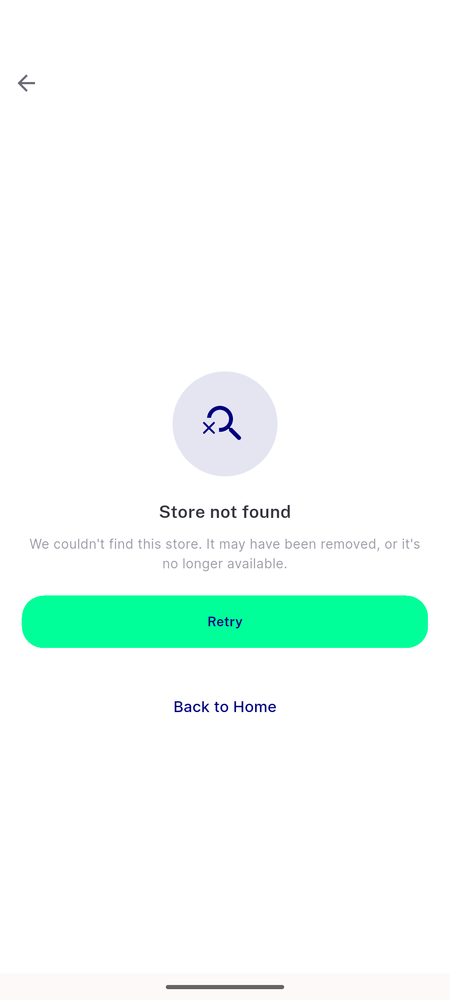
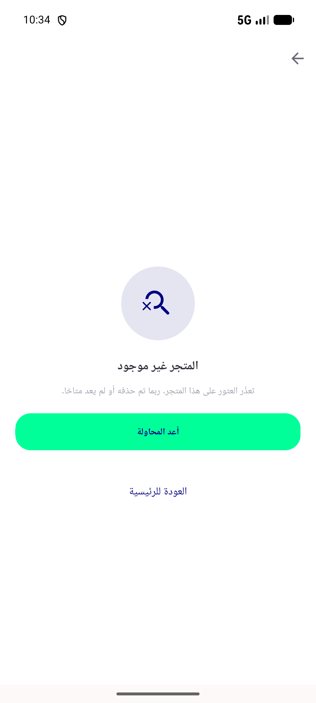

# QA Evidence — NEARS-1115

**BLOCKED: AC1/AC2/AC3/AC6(store-details) demonstrated live PASS; AC4/AC5 unverifiable — pre-existing nav blocker (reviews entry point missing on reskinned header), backed by live backend-contract proof + fresh unit test run**

**2 screenshot(s).** Click any thumbnail for full resolution.

<table>
<tr>
<td align="center" width="33%"> ac1 store not found en</td>
<td align="center" width="33%"> ac2 store not found ar rtl</td>
</tr>
</table>

### Other artifacts
- [`ac4-ac5-backend-contract-and-nav-blocker.log`](ac4-ac5-backend-contract-and-nav-blocker.log)

---
*From `nears/docs/qa-evidence/NEARS-1115/` · public-repo scrub policy (no live secrets; verified clean).*
