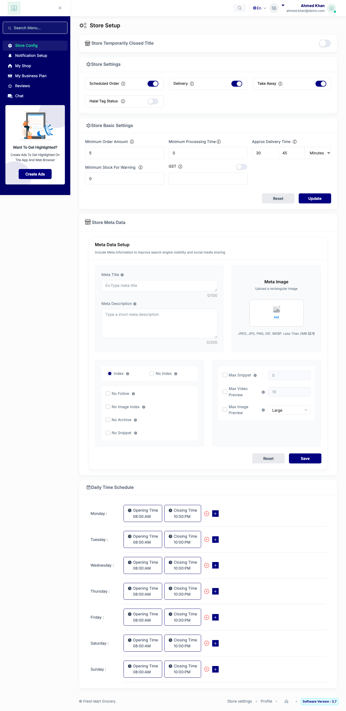

# QA Evidence — NEARS-1119

**PASS (delta re-QA, fix-cycle 1) — AC1/AC2/AC3 live 200s, correct min/max/unit; AC4 unverifiable (test-data gap), corroborated by static compile + phpunit**

**3 screenshot(s).** Click any thumbnail for full resolution.

<table>
<tr>
<td align="center" width="33%"> bug parse error store1</td>
<td align="center" width="33%"> bug parse error store2</td>
<td align="center" width="33%"> pass ac1 store2 fixcycle1</td>
</tr>
</table>

### Other artifacts
- [`bug-parse-error.log`](bug-parse-error.log)
- [`pass-fixcycle1.log`](pass-fixcycle1.log)

---
*From `nears/docs/qa-evidence/NEARS-1119/` · public-repo scrub policy (no live secrets; verified clean).*
