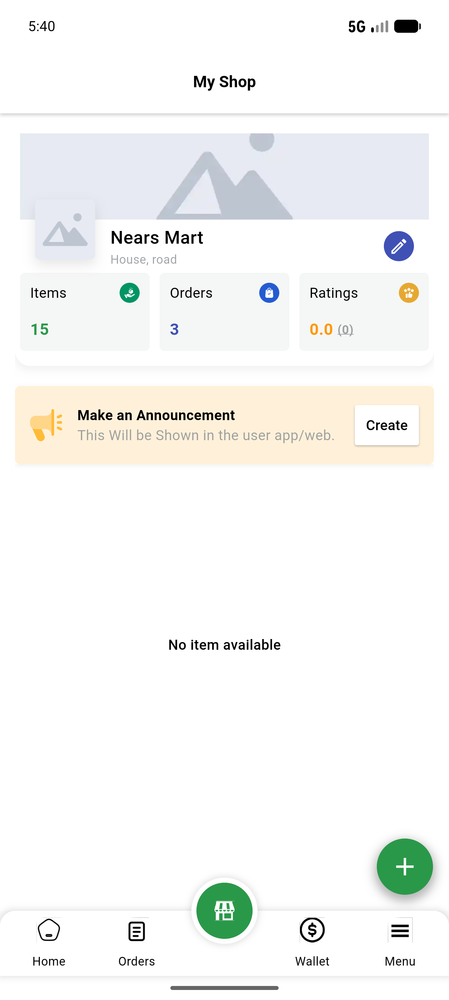

# QA Evidence — NEARS-1120

**PASS - GST field accepts alphanumeric + numeric codes, round-trips via /api/v1/vendor/update-business-setup, toggle gates field correctly**

**1 screenshot(s).** Click any thumbnail for full resolution.

<table>
<tr>
<td align="center" width="33%"> gst field numeric roundtrip</td>
</tr>
</table>

---
*From `nears/docs/qa-evidence/NEARS-1120/` · public-repo scrub policy (no live secrets; verified clean).*
