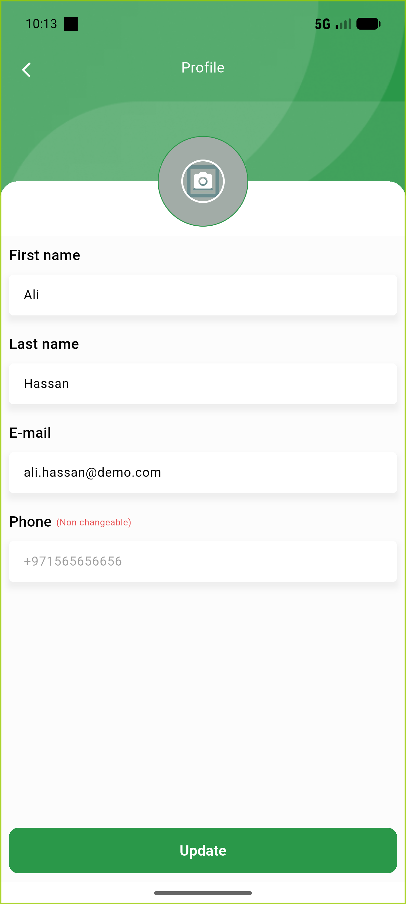
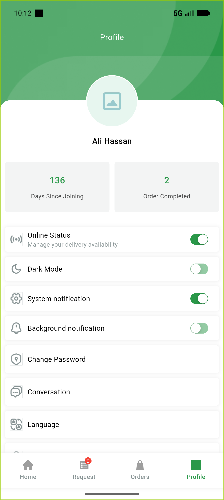

# QA Evidence — NEARS-1127

**PASS - identity_image_full_url leak fixed; 4/4 AC demonstrated live + 7/7 automated tests**

**2 screenshot(s).** Click any thumbnail for full resolution.

<table>
<tr>
<td align="center" width="33%"> ac4 deliveryapp editprofile</td>
<td align="center" width="33%"> ac4 deliveryapp profile</td>
</tr>
</table>

### Other artifacts
- [`ac1-own-profile.log`](ac1-own-profile.log)
- [`ac2-vendor-list.log`](ac2-vendor-list.log)
- [`ac3-customer-track.log`](ac3-customer-track.log)
- [`ac3-vendor-preview.log`](ac3-vendor-preview.log)

---
*From `nears/docs/qa-evidence/NEARS-1127/` · public-repo scrub policy (no live secrets; verified clean).*
