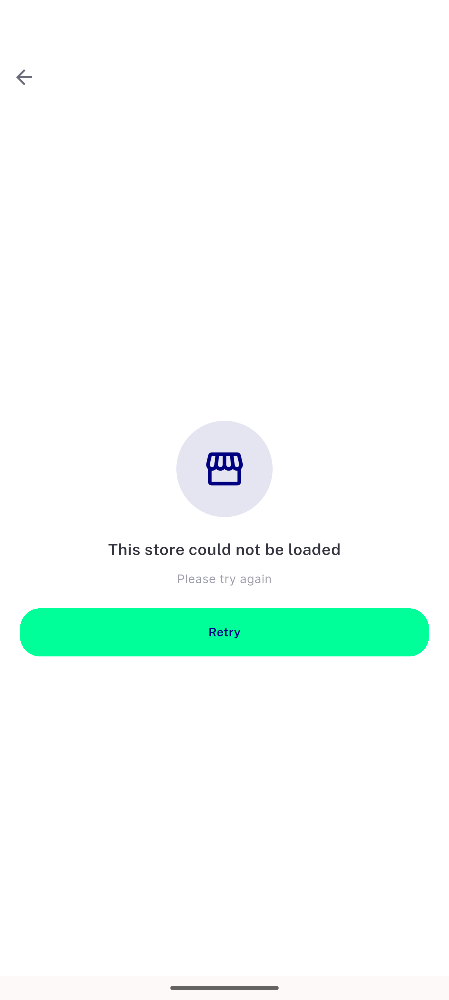
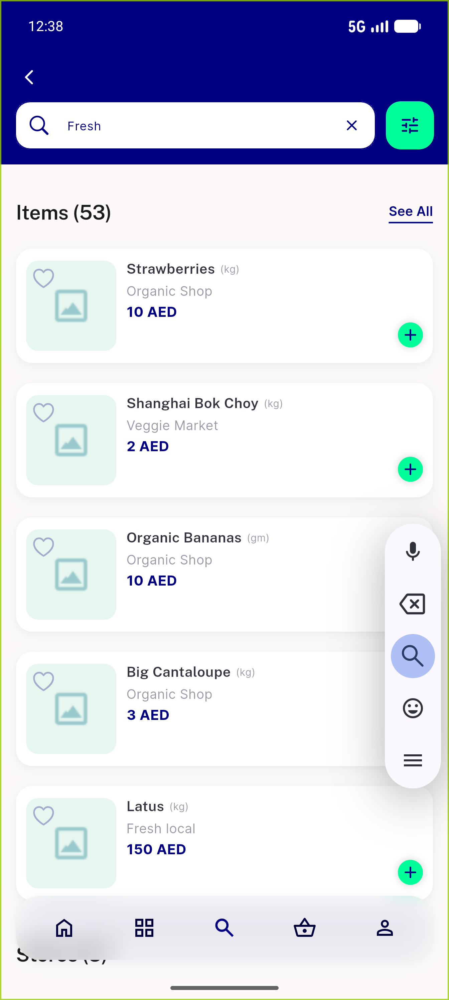
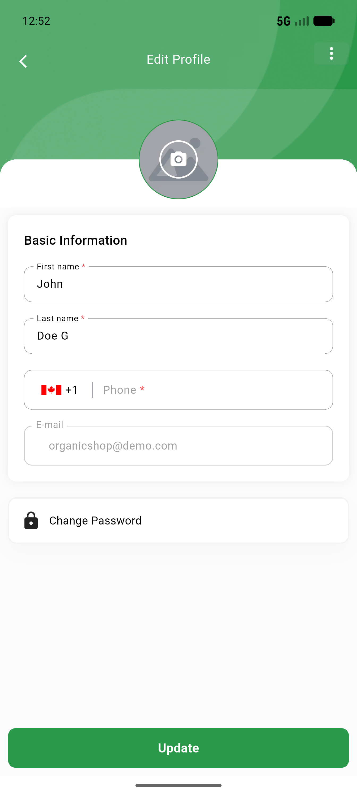
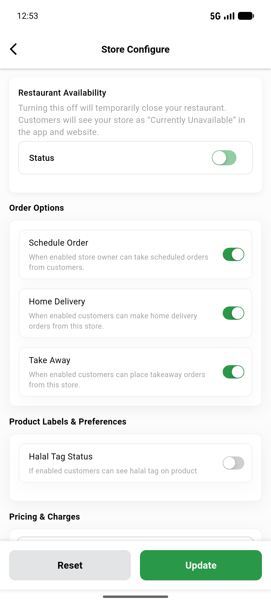

# QA Evidence — NEARS-1129

**PASS — numeric lat/lng renders clean (UserApp+VendorApp), NEARS-1098 guard intact, real string wire-shape unchanged**

**4 screenshot(s).** Click any thumbnail for full resolution.

<table>
<tr>
<td align="center" width="33%"> userapp nears1098 guard still works</td>
<td align="center" width="33%"> userapp search numeric results</td>
<td align="center" width="33%"> vendorapp numeric profile</td>
</tr>
<tr>
<td align="center" width="33%"> vendorapp string regression</td>
</tr>
</table>

### Other artifacts
- [`verify.log`](verify.log)

---
*From `nears/docs/qa-evidence/NEARS-1129/` · public-repo scrub policy (no live secrets; verified clean).*
