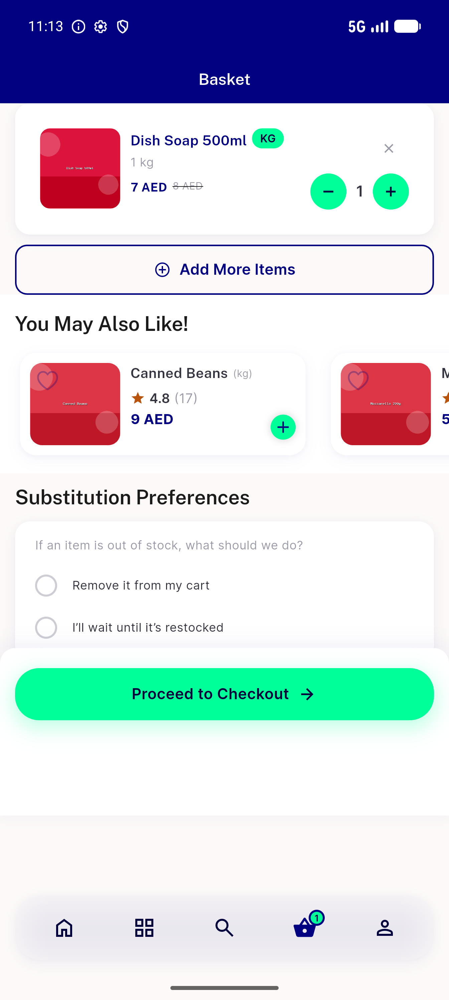
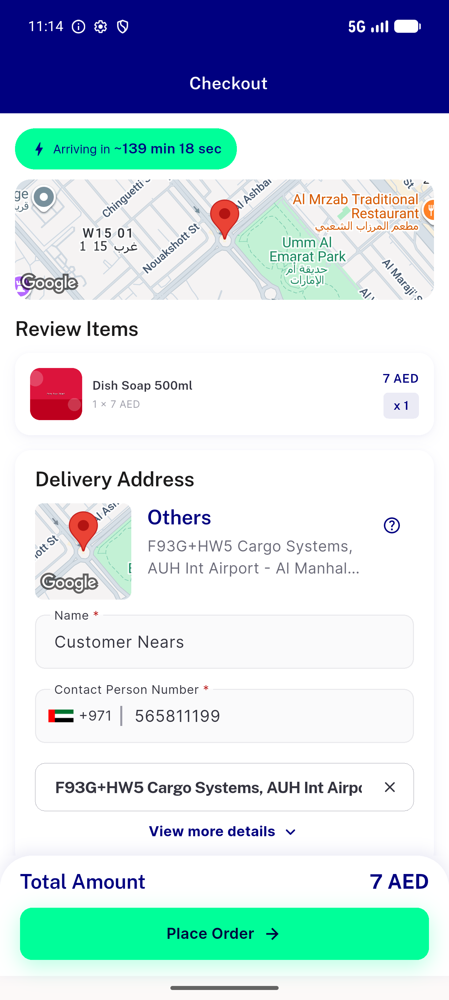
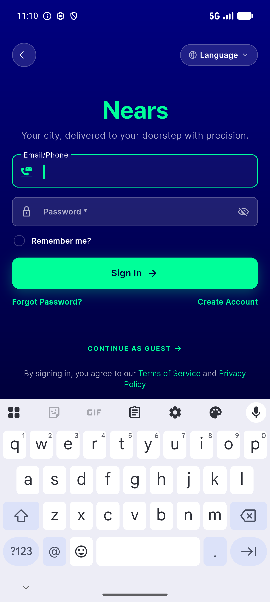
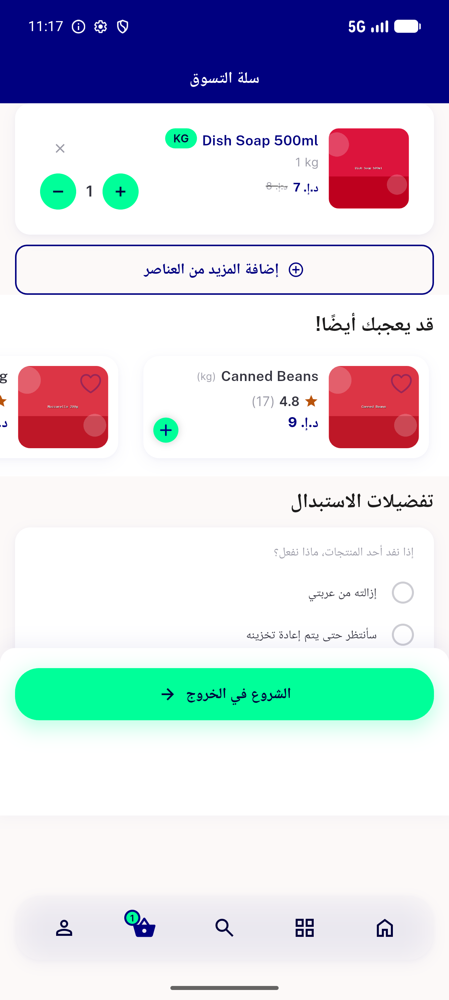

# QA Evidence — NEARS-1130

**PASS — NearsPrimaryButton a11y boundary: label announced once, Button role, focusable; visual/tap unchanged across 4 live CTAs + RTL**

**4 screenshot(s).** Click any thumbnail for full resolution.

<table>
<tr>
<td align="center" width="33%"> cart checkout cta</td>
<td align="center" width="33%"> checkout place order</td>
<td align="center" width="33%"> signin cta</td>
</tr>
<tr>
<td align="center" width="33%"> rtl checkout cta</td>
</tr>
</table>

### Other artifacts
- [`semantics-nodes.log`](semantics-nodes.log)

---
*From `nears/docs/qa-evidence/NEARS-1130/` · public-repo scrub policy (no live secrets; verified clean).*
