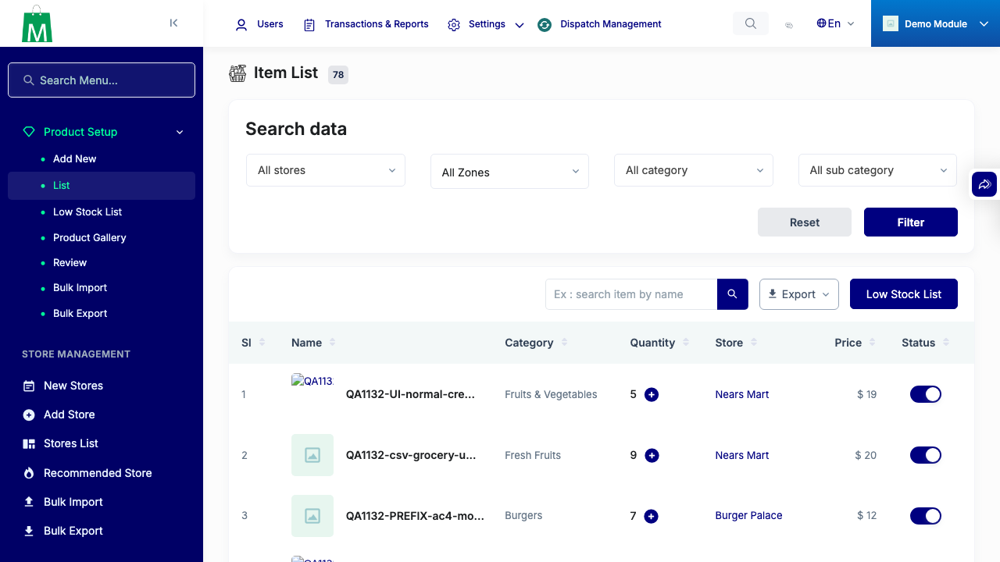

# QA Evidence — NEARS-1132

**PASS — module_id now follows the store on create/update/bulk-import; bug reproduced on pre-fix build and fixed on the branch; 948/948 phpunit green**

**1 screenshot(s).** Click any thumbnail for full resolution.

<table>
<tr>
<td align="center" width="33%"> ac2 ui normal create</td>
</tr>
</table>

### Other artifacts
- [`ac-evidence.log`](ac-evidence.log)
- [`bug-admin-login-captcha-bypass.log`](bug-admin-login-captcha-bypass.log)
- [`bug-bulk-import-pharmacy-details-wrong-row.log`](bug-bulk-import-pharmacy-details-wrong-row.log)
- [`final-invariants.log`](final-invariants.log)

---
*From `nears/docs/qa-evidence/NEARS-1132/` · public-repo scrub policy (no live secrets; verified clean).*
