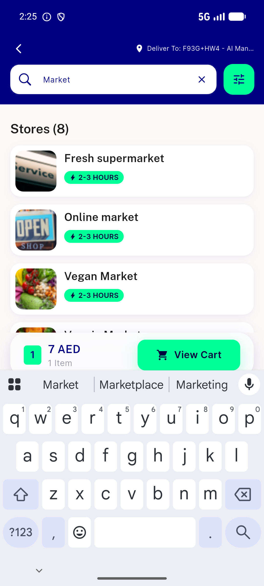

# QA Evidence — NEARS-1141

**FAIL — post-fix Search store-row a11y node still android.widget.ImageView (no Button role projected); NEARS-963 on-device projection failure**

**1 screenshot(s).** Click any thumbnail for full resolution.

<table>
<tr>
<td align="center" width="33%"> bug storecard role not projected</td>
</tr>
</table>

### Other artifacts
- [`postfix-row.xml`](postfix-row.xml)
- [`prefix-row.xml`](prefix-row.xml)

---
*From `nears/docs/qa-evidence/NEARS-1141/` · public-repo scrub policy (no live secrets; verified clean).*
