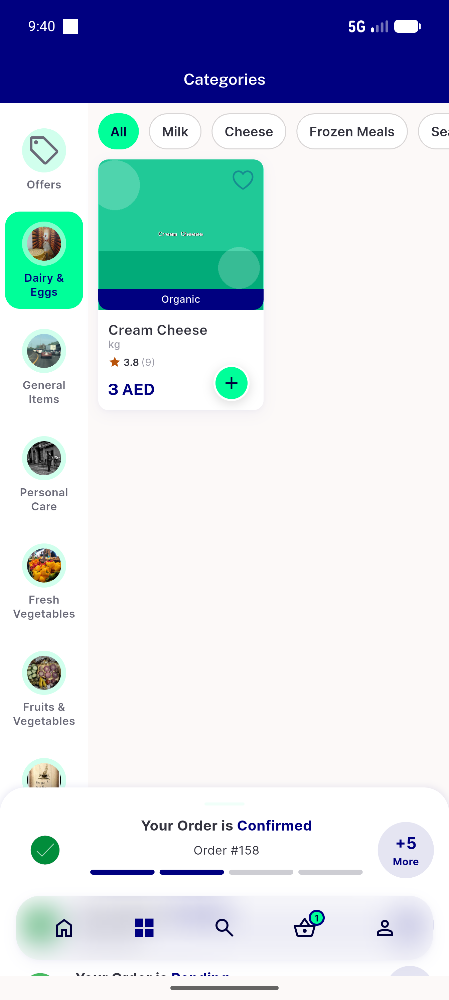

# QA Evidence — NEARS-1142

**PASS: ui_nodes helper — AC1/AC2/AC3 confirmed live on emulator-5554**

**1 screenshot(s).** Click any thumbnail for full resolution.

<table>
<tr>
<td align="center" width="33%"> categories screen</td>
</tr>
</table>

---
*From `nears/docs/qa-evidence/NEARS-1142/` · public-repo scrub policy (no live secrets; verified clean).*
