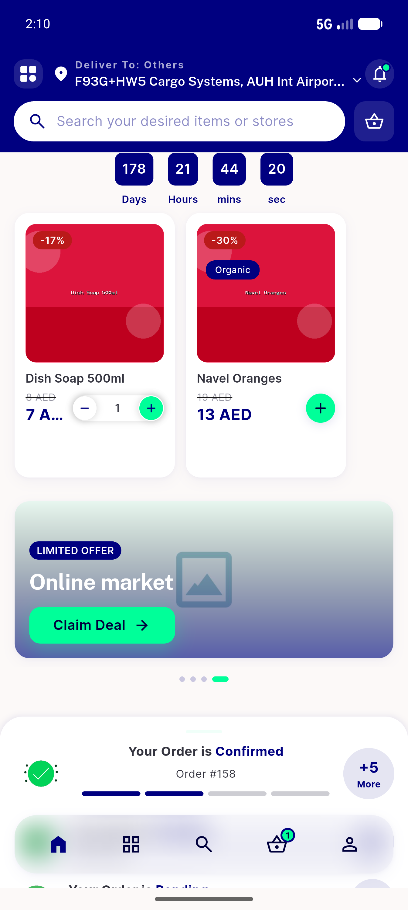
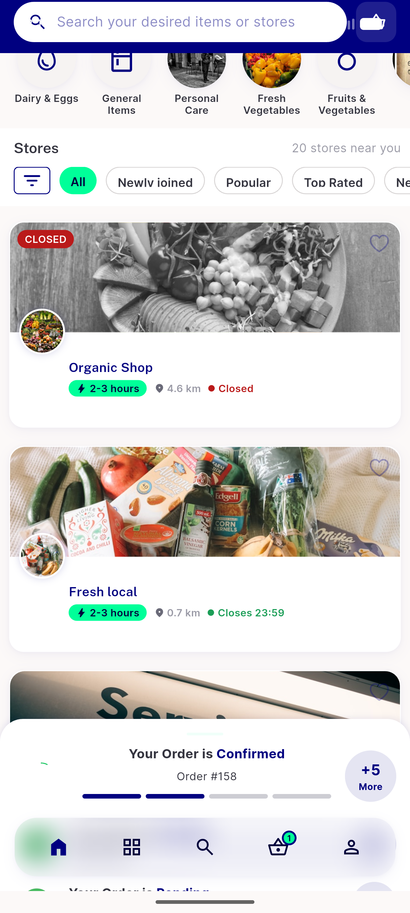
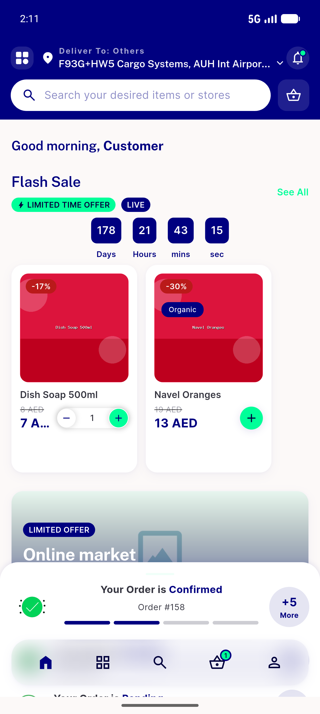
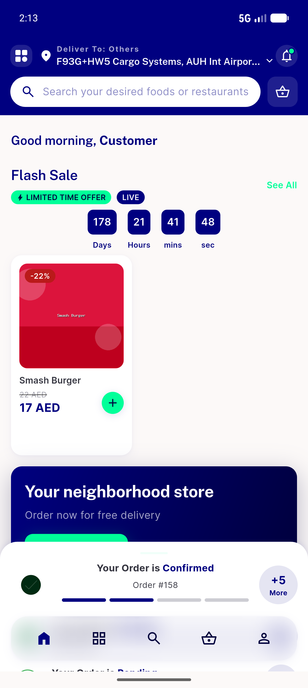

# QA Evidence — NEARS-1148

**PASS — taxi-guard unify predicate: non-taxi home cold-load + refresh + module-switch fan-out intact; taxi arm unit-verified 6/6**

**4 screenshot(s).** Click any thumbnail for full resolution.

<table>
<tr>
<td align="center" width="33%"> ac live 1 coldload grocery home</td>
<td align="center" width="33%"> ac live 1 coldload store rails</td>
<td align="center" width="33%"> ac live 2 after refresh</td>
</tr>
<tr>
<td align="center" width="33%"> regression food module home</td>
</tr>
</table>

### Other artifacts
- [`progress.md`](progress.md)

---
*From `nears/docs/qa-evidence/NEARS-1148/` · public-repo scrub policy (no live secrets; verified clean).*
