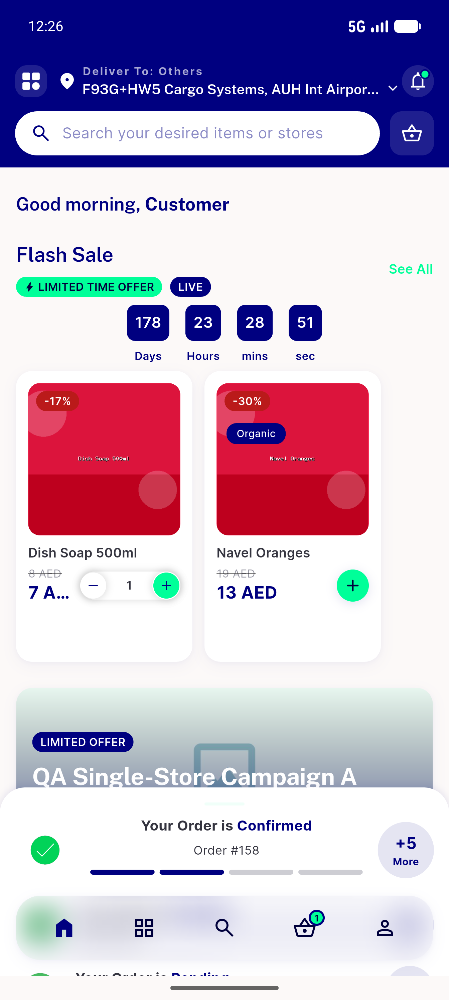
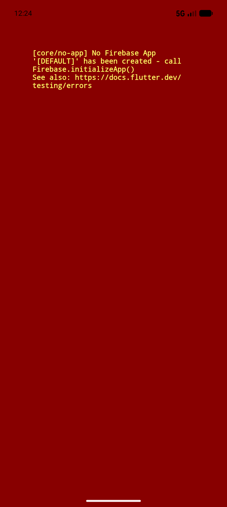

# QA Evidence — NEARS-1149

**PASS — taxi-guard null-safety: home_controller suite 115/115 green, RED-proven, live non-taxi cold-load clean**

**3 screenshot(s).** Click any thumbnail for full resolution.

<table>
<tr>
<td align="center" width="33%"> ac4 userapp home clean</td>
<td align="center" width="33%"> bug vendorapp firebase redscreen 2</td>
<td align="center" width="33%"> bug vendorapp firebase redscreen</td>
</tr>
</table>

### Other artifacts
- [`ac5-home-suite-full.log`](ac5-home-suite-full.log)
- [`prefix-revert-RED.log`](prefix-revert-RED.log)
- [`test-taxi-gate-suite.log`](test-taxi-gate-suite.log)

---
*From `nears/docs/qa-evidence/NEARS-1149/` · public-repo scrub policy (no live secrets; verified clean).*
