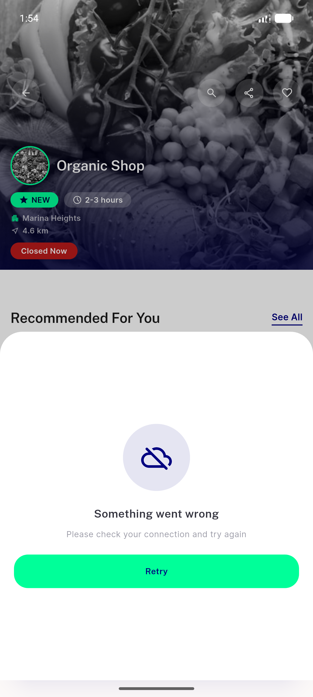
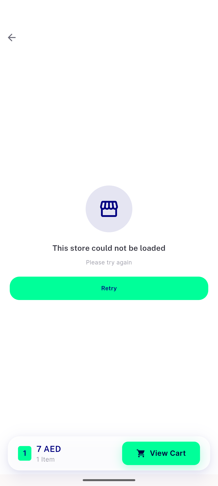

# QA Evidence — NEARS-1156

**PASS (2/2 live-triggerable ACs verified; server/unknown kinds confirmed via automated widget tests - real backend converts all exceptions to 404)**

**2 screenshot(s).** Click any thumbnail for full resolution.

<table>
<tr>
<td align="center" width="33%"> kind connectivity item detail</td>
<td align="center" width="33%"> store load failure storefront override</td>
</tr>
</table>

---
*From `nears/docs/qa-evidence/NEARS-1156/` · public-repo scrub policy (no live secrets; verified clean).*
