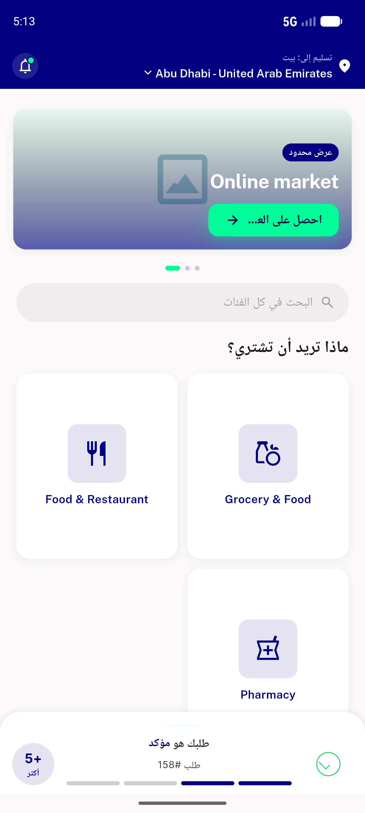

# QA Evidence — NEARS-1159

**PASS — l10n delegates wired; Material built-ins render Arabic under ar_SA (dismiss=رفض, ok=حسنًا, cancel=الإلغاء); test green; build OK; en regression clean**

**2 screenshot(s).** Click any thumbnail for full resolution.

<table>
<tr>
<td align="center" width="33%"> ac2 home arabic</td>
<td align="center" width="33%"> ac4 home english</td>
</tr>
</table>

---
*From `nears/docs/qa-evidence/NEARS-1159/` · public-repo scrub policy (no live secrets; verified clean).*
