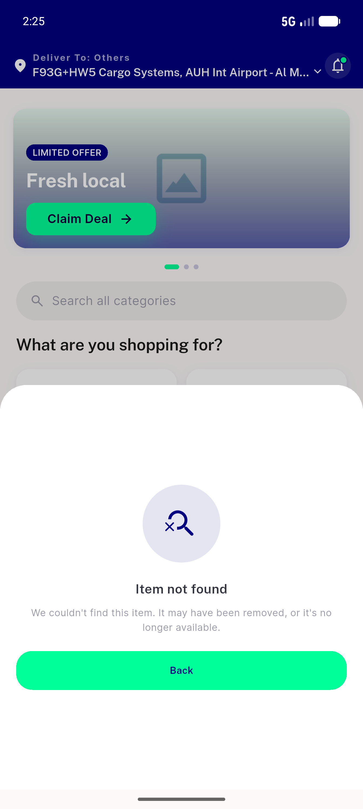
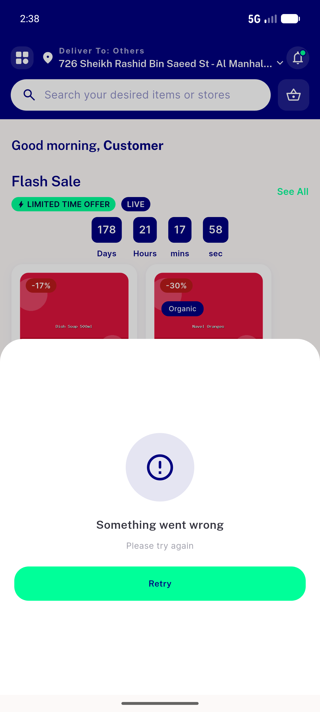
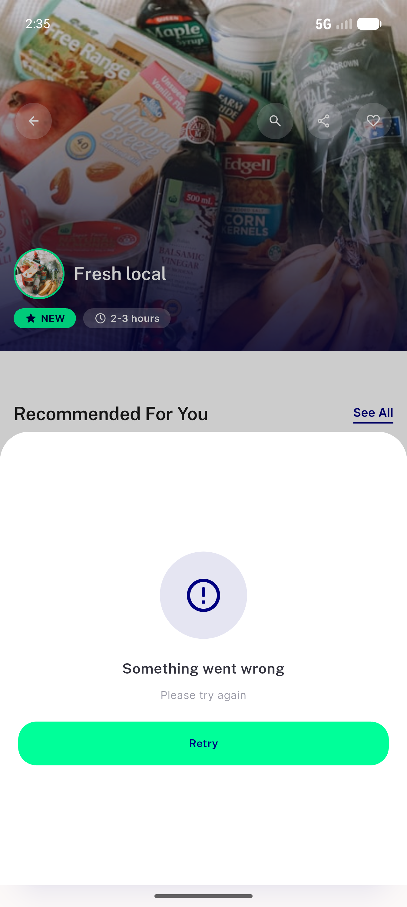
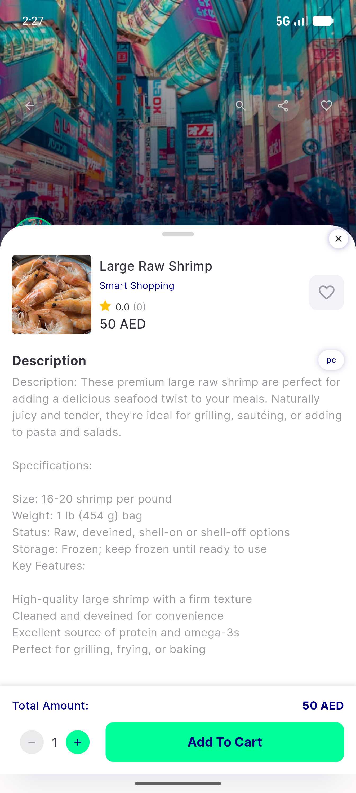
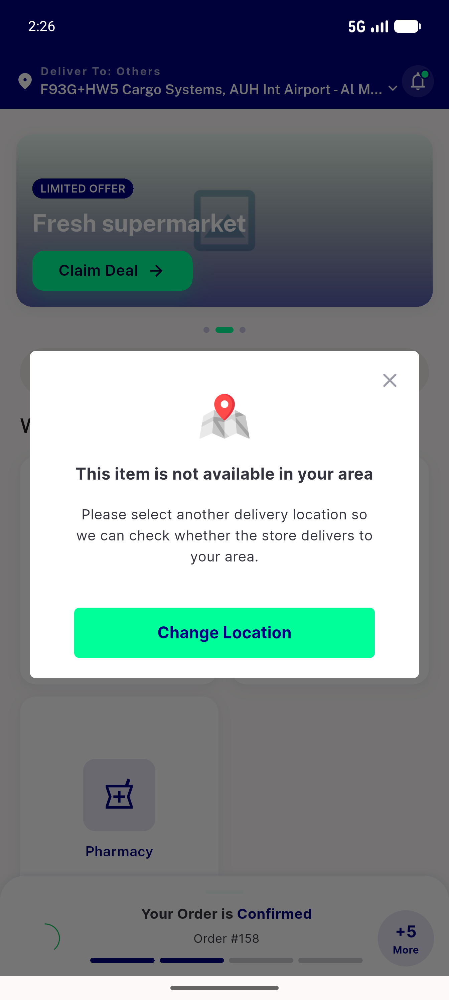

# QA Evidence — NEARS-1162

**PASS - deep-link 404/timeout fallback sheet, all 5 ACs demonstrated live**

**5 screenshot(s).** Click any thumbnail for full resolution.

<table>
<tr>
<td align="center" width="33%"> ac1 terminal not found</td>
<td align="center" width="33%"> ac2 retryable state clean</td>
<td align="center" width="33%"> ac2 retryable state</td>
</tr>
<tr>
<td align="center" width="33%"> ac3 valid item</td>
<td align="center" width="33%"> ac4 out of zone</td>
</tr>
</table>

---
*From `nears/docs/qa-evidence/NEARS-1162/` · public-repo scrub policy (no live secrets; verified clean).*
