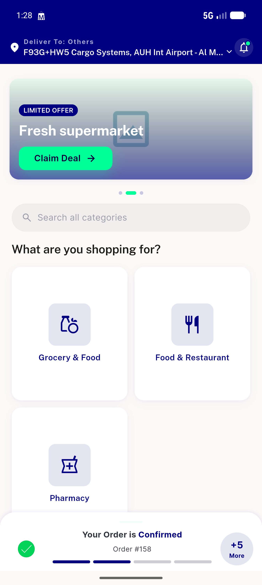

# QA Evidence — NEARS-1170

**PASS - splash/home regression smoke, getModules() zero-arg cache-key resolves normally, no crash/red-screen**

**1 screenshot(s).** Click any thumbnail for full resolution.

<table>
<tr>
<td align="center" width="33%"> home module grid</td>
</tr>
</table>

---
*From `nears/docs/qa-evidence/NEARS-1170/` · public-repo scrub policy (no live secrets; verified clean).*
