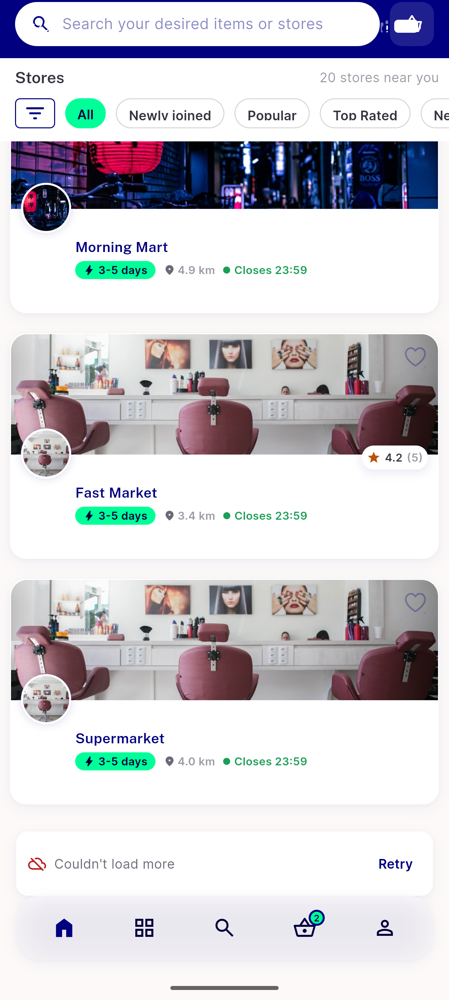
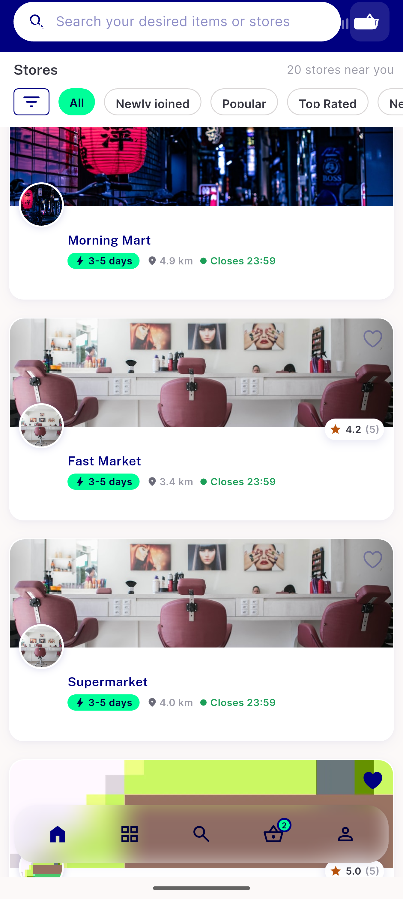
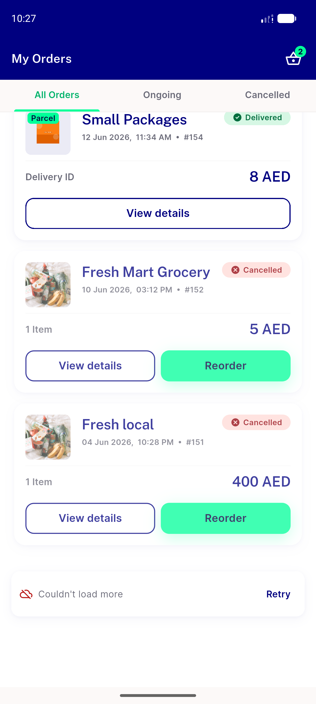
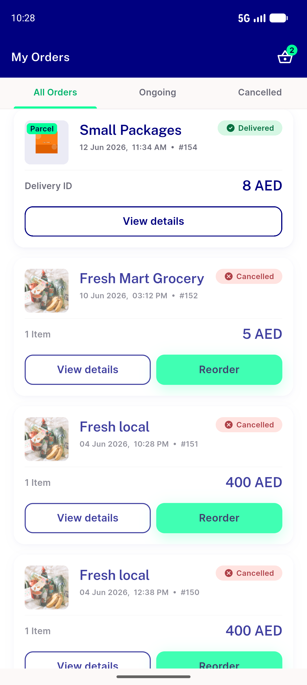

# QA Evidence — NEARS-1173

**PASS — load-more retry rows verified live on My Orders History + Home all-stores (AC1/2/3); 4/6 surfaces mechanism-proven via 10/10 test**

**4 screenshot(s).** Click any thumbnail for full resolution.

<table>
<tr>
<td align="center" width="33%"> home 01 error row</td>
<td align="center" width="33%"> home 02 recovered</td>
<td align="center" width="33%"> orders 01 error row</td>
</tr>
<tr>
<td align="center" width="33%"> orders 02 recovered</td>
</tr>
</table>

---
*From `nears/docs/qa-evidence/NEARS-1173/` · public-repo scrub policy (no live secrets; verified clean).*
