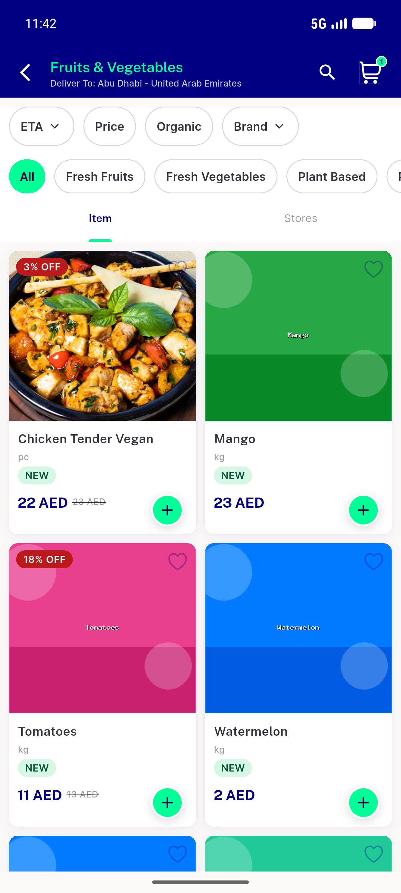
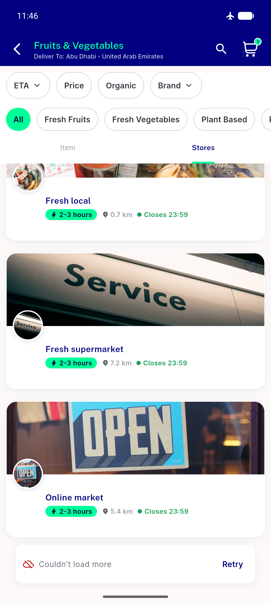
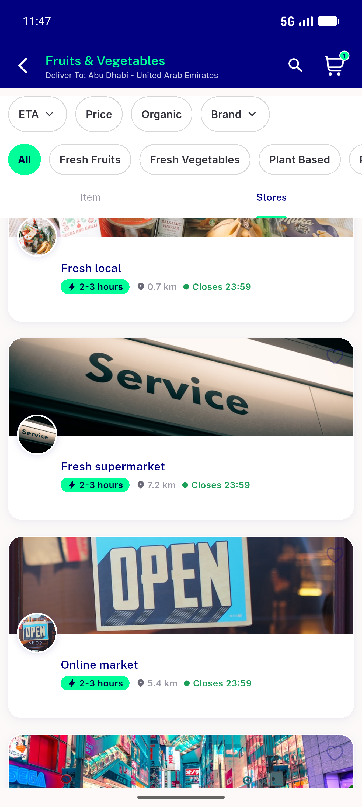

# QA Evidence — NEARS-1174

**PASS — store-tab load-more error row + scroll gate + retry demonstrated LIVE; item-tab via widget-test + live store-axis mirror (dev-data gap blocks item-axis live failure); AC5 [FAIL] PII-safe single log**

**3 screenshot(s).** Click any thumbnail for full resolution.

<table>
<tr>
<td align="center" width="33%"> item tab loaded</td>
<td align="center" width="33%"> store tab error row</td>
<td align="center" width="33%"> store tab retry cleared</td>
</tr>
</table>

### Other artifacts
- [`ac5-store-fail-log.txt`](ac5-store-fail-log.txt)

---
*From `nears/docs/qa-evidence/NEARS-1174/` · public-repo scrub policy (no live secrets; verified clean).*
