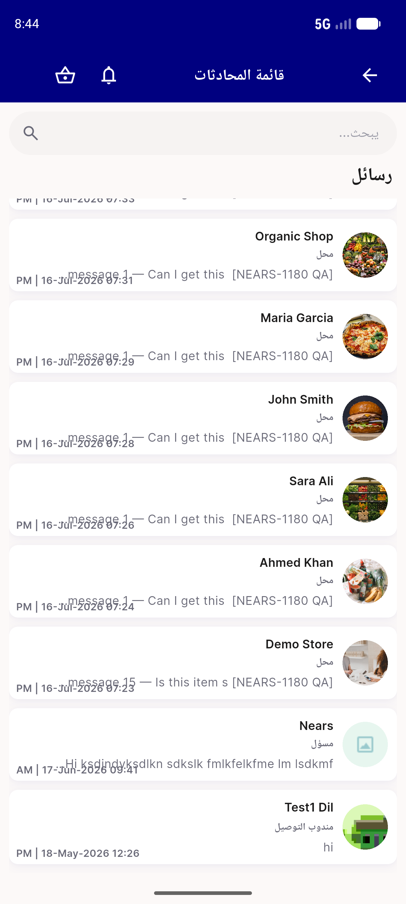
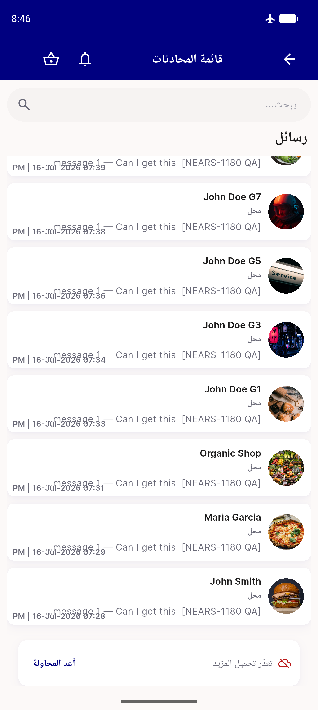
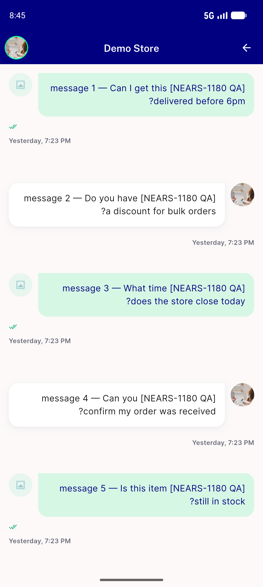
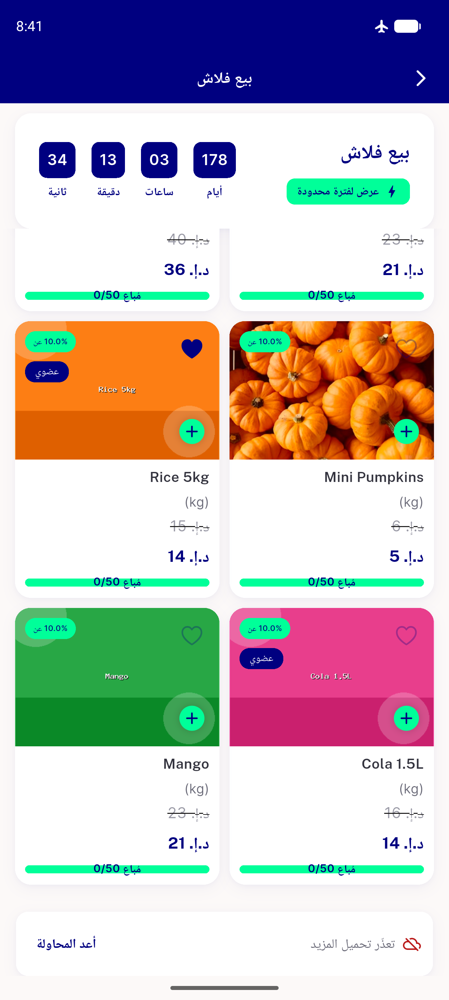
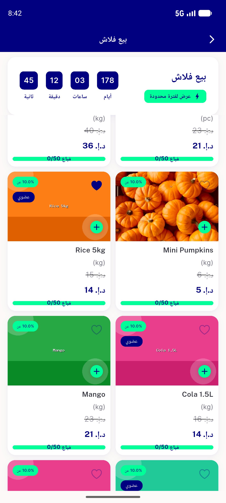
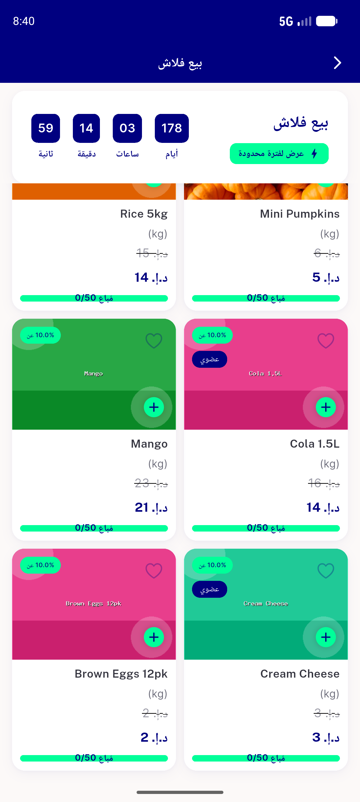
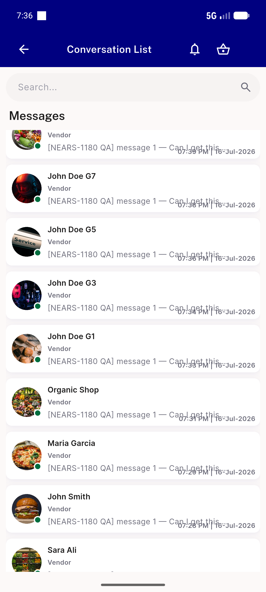
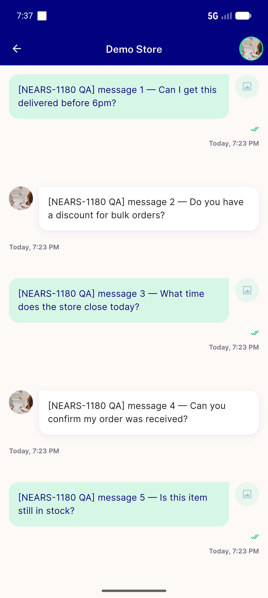
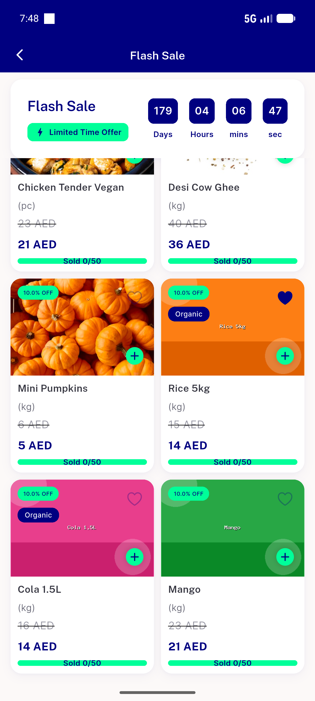

# QA Evidence — NEARS-1180

**NEARS-1180 delta re-QA PASS — AC1-AC4 all pass; AC4 (prev FAIL, NEARS-1264 fix) now live-verified on 4fd5f65d**

**9 screenshot(s).** Click any thumbnail for full resolution.

<table>
<tr>
<td align="center" width="33%"> ac1 chatlist page2</td>
<td align="center" width="33%"> ac2 chatlist failure retry</td>
<td align="center" width="33%"> ac3 conversation page2</td>
</tr>
<tr>
<td align="center" width="33%"> ac4 failure retry row</td>
<td align="center" width="33%"> ac4 retry recovered</td>
<td align="center" width="33%"> ac4 success page2 loaded</td>
</tr>
<tr>
<td align="center" width="33%"> chat conversation list retry success</td>
<td align="center" width="33%"> chat messages offset2 distinct</td>
<td align="center" width="33%"> flash sale scroll stuck no page2</td>
</tr>
</table>

---
*From `nears/docs/qa-evidence/NEARS-1180/` · public-repo scrub policy (no live secrets; verified clean).*
