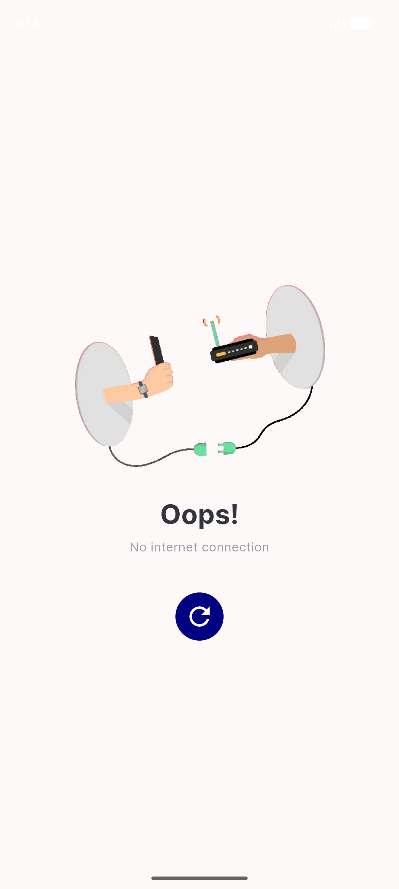

# QA Evidence — NEARS-1190

**PASS — transport-throw failure signal: AC1/2/7/8/9 + copy + logs all verified live on emulator-5554, pre-fix contrast proven**

**4 screenshot(s).** Click any thumbnail for full resolution.

<table>
<tr>
<td align="center" width="33%"> ac1 PREFIX no snackbar</td>
<td align="center" width="33%"> ac1 offline snackbar</td>
<td align="center" width="33%"> ac7 ac8 cold offline</td>
</tr>
<tr>
<td align="center" width="33%"> ac7 toast storm</td>
</tr>
</table>

---
*From `nears/docs/qa-evidence/NEARS-1190/` · public-repo scrub policy (no live secrets; verified clean).*
