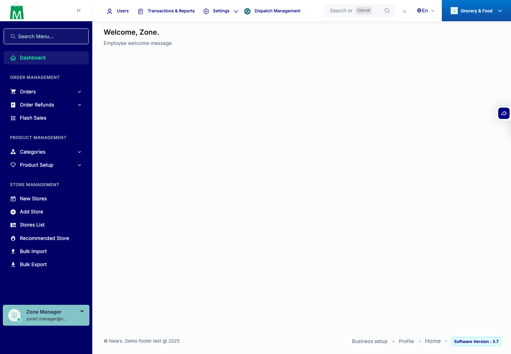
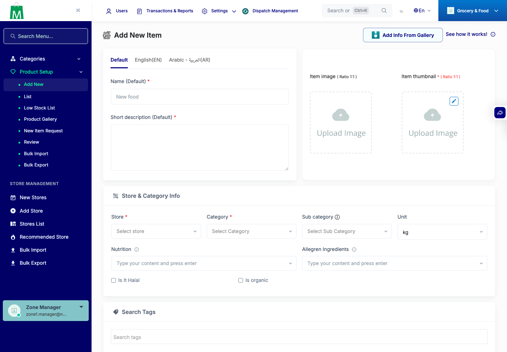
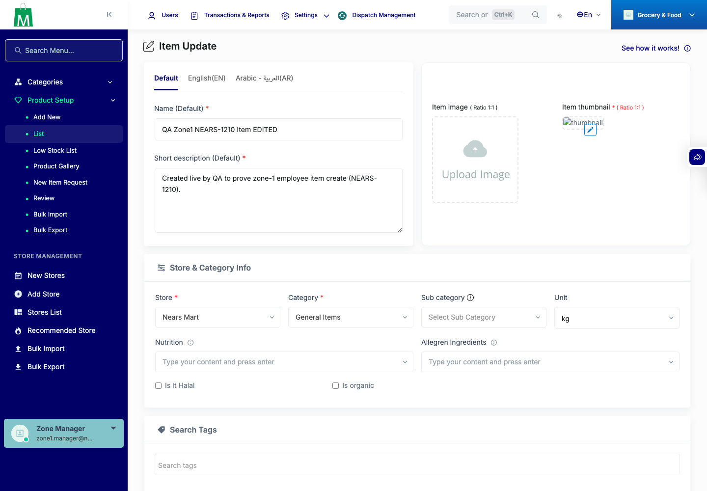
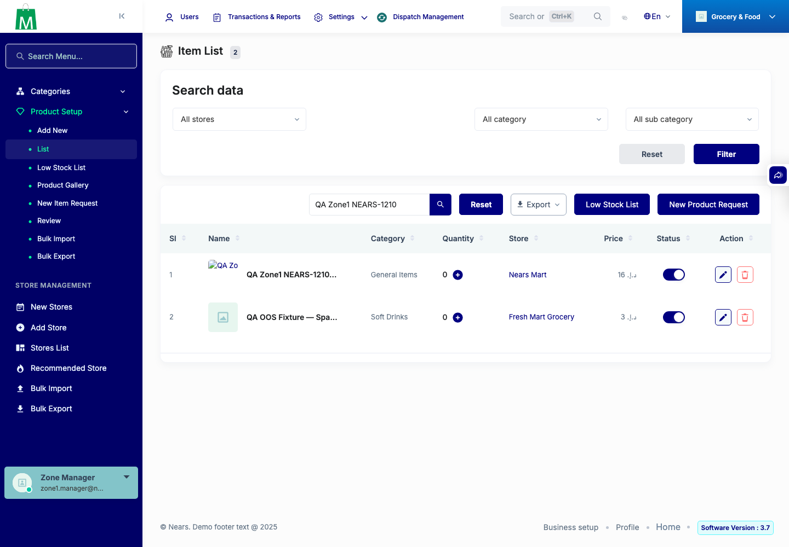
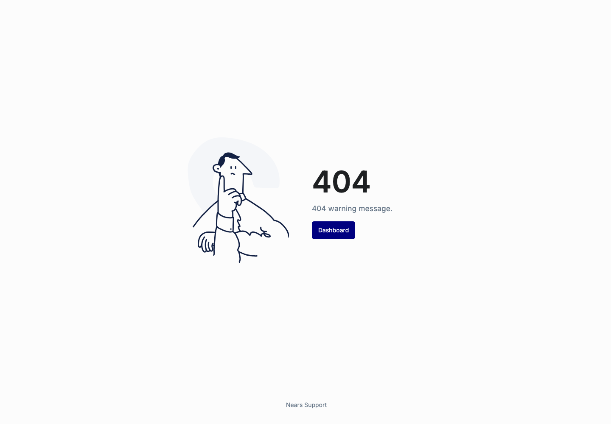

# QA Evidence — NEARS-1210

**PASS — zone-admin test fixture: seed+idempotency+guard+login+item CREATE/EDIT zone-scoped (zone-2 denied)**

**5 screenshot(s).** Click any thumbnail for full resolution.

<table>
<tr>
<td align="center" width="33%"> ac4 dashboard</td>
<td align="center" width="33%"> ac5 add item form</td>
<td align="center" width="33%"> ac5 edit created item</td>
</tr>
<tr>
<td align="center" width="33%"> ac5 item list created</td>
<td align="center" width="33%"> ac6 zone2 item 404</td>
</tr>
</table>

---
*From `nears/docs/qa-evidence/NEARS-1210/` · public-repo scrub policy (no live secrets; verified clean).*
