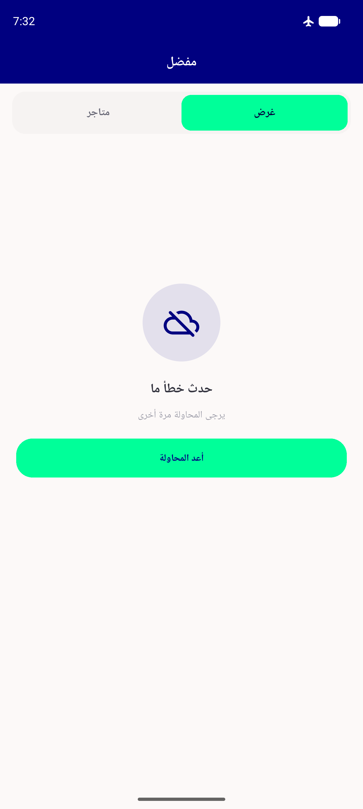
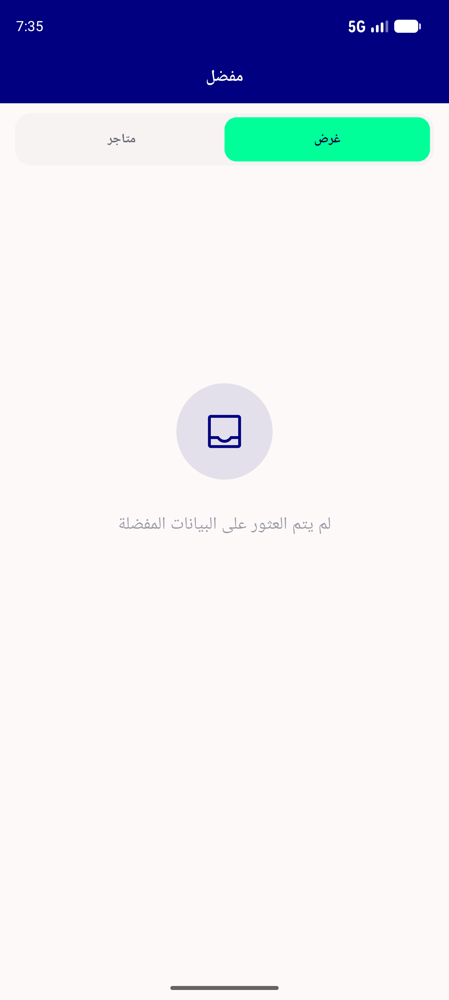

# QA Evidence — NEARS-1222

**PASS — favourites load-failure shows NearsErrorRetry + retry recovers (light/RTL, emu-5556)**

**5 screenshot(s).** Click any thumbnail for full resolution.

<table>
<tr>
<td align="center" width="33%"> home</td>
<td align="center" width="33%"> fav online items</td>
<td align="center" width="33%"> fav offline error retry</td>
</tr>
<tr>
<td align="center" width="33%"> fav retry success items</td>
<td align="center" width="33%"> fav genuine empty</td>
</tr>
</table>

### Other artifacts
- [`bug-favourite-ticker-leak.log`](bug-favourite-ticker-leak.log)

---
*From `nears/docs/qa-evidence/NEARS-1222/` · public-repo scrub policy (no live secrets; verified clean).*
