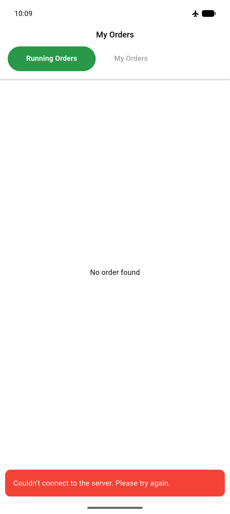
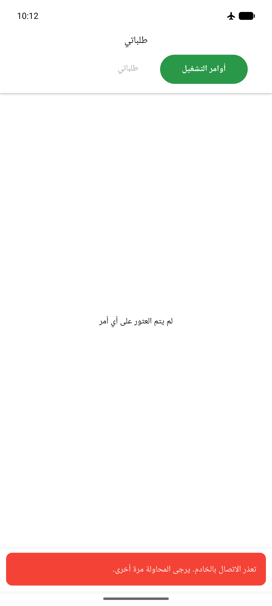

# QA Evidence — NEARS-1223

**PASS — DeliveryApp transport-throw now signals user (EN+AR live), 214/214 tests GREEN**

**3 screenshot(s).** Click any thumbnail for full resolution.

<table>
<tr>
<td align="center" width="33%"> ac1 offline toast</td>
<td align="center" width="33%"> ac6 arabic hotswitch</td>
<td align="center" width="33%"> ac6 arabic toast</td>
</tr>
</table>

---
*From `nears/docs/qa-evidence/NEARS-1223/` · public-repo scrub policy (no live secrets; verified clean).*
