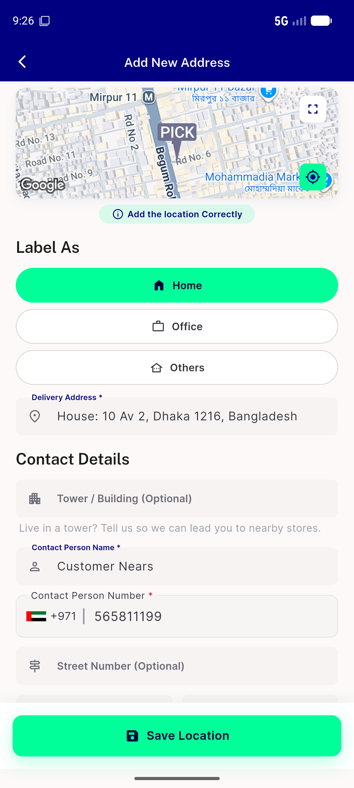
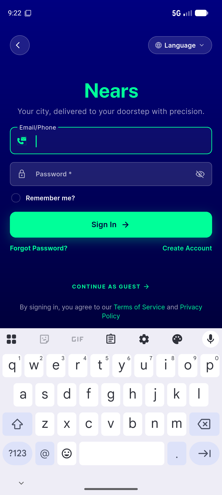

# QA Evidence — NEARS-1249

**PASS — NearsInput duplicate-Semantics fix verified live: exactly 1 textField accessibility node per field on login/signup/add-address, no regressions**

**3 screenshot(s).** Click any thumbnail for full resolution.

<table>
<tr>
<td align="center" width="33%"> add address visual</td>
<td align="center" width="33%"> login visual</td>
<td align="center" width="33%"> signup visual</td>
</tr>
</table>

---
*From `nears/docs/qa-evidence/NEARS-1249/` · public-repo scrub policy (no live secrets; verified clean).*
