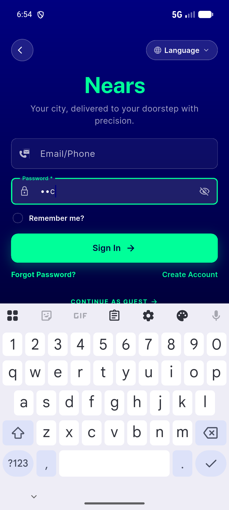
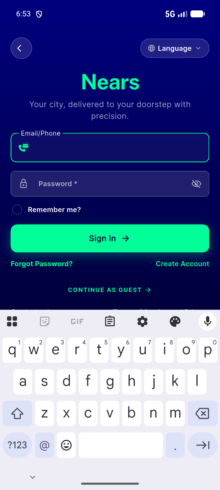

# QA Evidence — NEARS-1251

**PASS — required NearsInput a11y label natural ('Password, Required'), visible 'Password *' unchanged, focus-swap intact; 144 DLS tests green**

**2 screenshot(s).** Click any thumbnail for full resolution.

<table>
<tr>
<td align="center" width="33%"> signin password focused</td>
<td align="center" width="33%"> signin required label</td>
</tr>
</table>

---
*From `nears/docs/qa-evidence/NEARS-1251/` · public-repo scrub policy (no live secrets; verified clean).*
