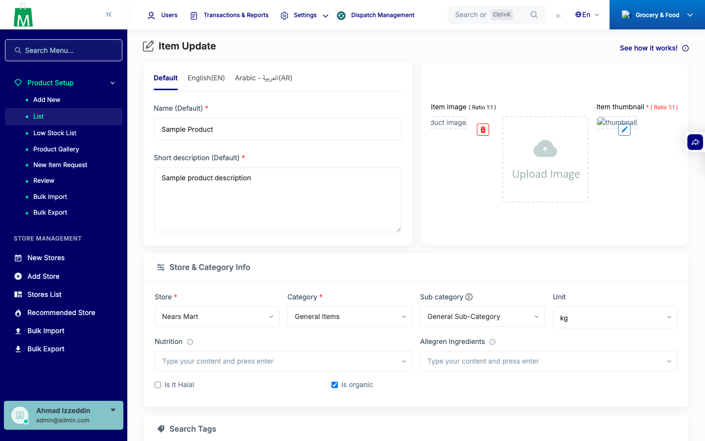
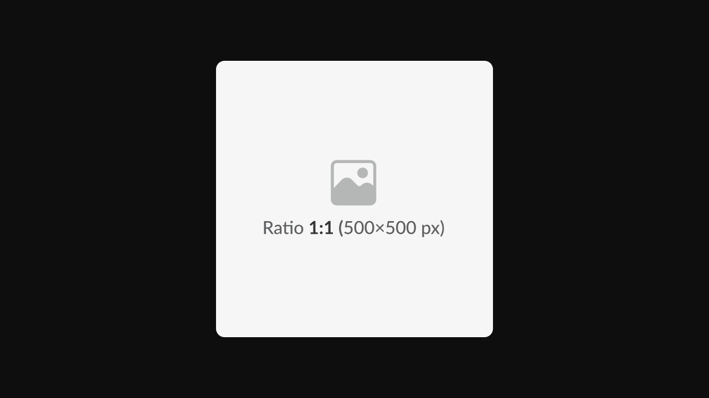
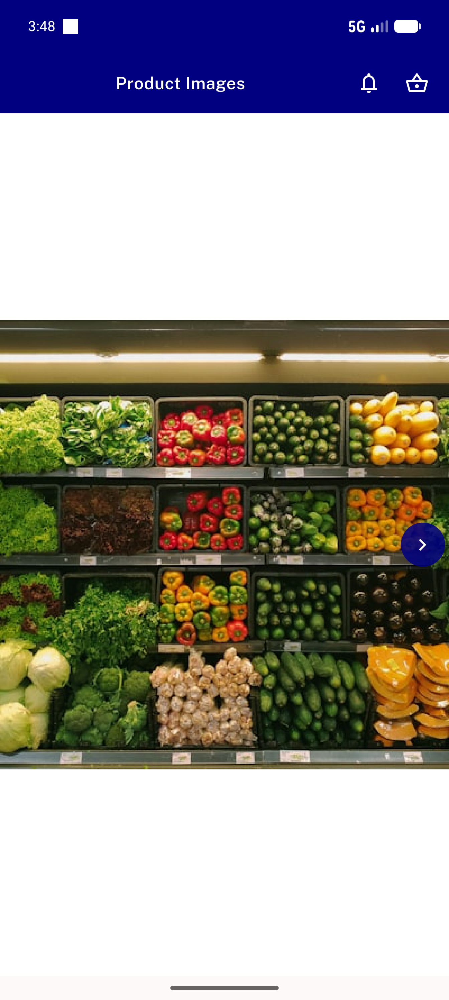
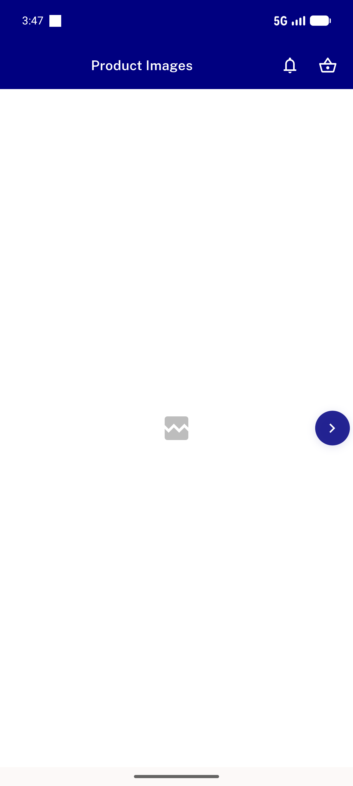
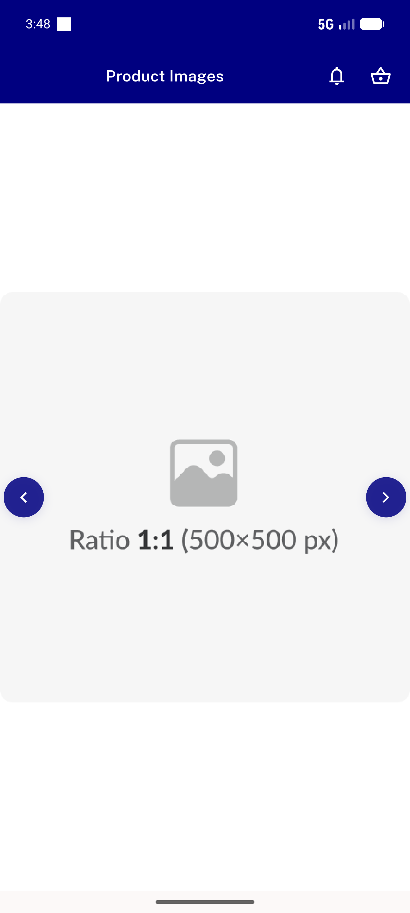
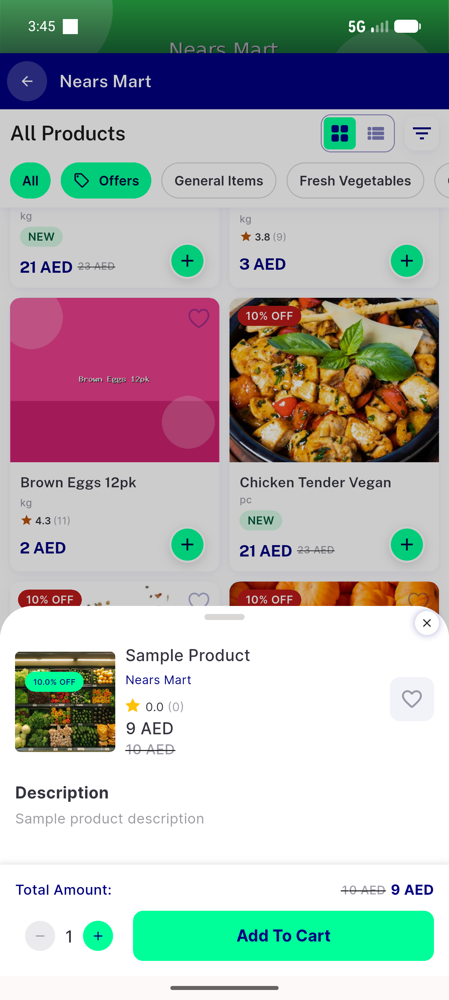

# QA Evidence — NEARS-1262

**PASS — item id=1 gallery images render live (Admin + UserApp)**

**6 screenshot(s).** Click any thumbnail for full resolution.

<table>
<tr>
<td align="center" width="33%"> ac1 admin item edit full</td>
<td align="center" width="33%"> ac1 gallery image 1 rendered</td>
<td align="center" width="33%"> ac1 userapp image gallery slide1 retry</td>
</tr>
<tr>
<td align="center" width="33%"> ac1 userapp image gallery slide1</td>
<td align="center" width="33%"> ac1 userapp image gallery slide2</td>
<td align="center" width="33%"> ac1 userapp item details 1</td>
</tr>
</table>

---
*From `nears/docs/qa-evidence/NEARS-1262/` · public-repo scrub policy (no live secrets; verified clean).*
