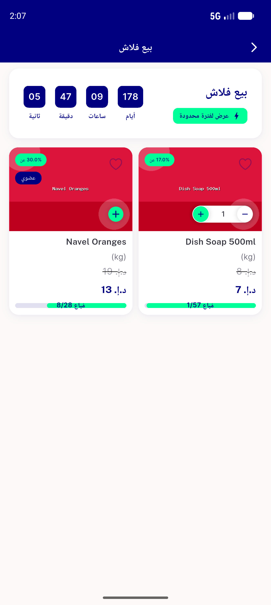

# QA Evidence — NEARS-1264

**QA-lite PASS: NEARS-1264 flash-sale scroll-controller fix verified (code+unit-test+backend); live network-trigger repro inconclusive via ADB automation**

**1 screenshot(s).** Click any thumbnail for full resolution.

<table>
<tr>
<td align="center" width="33%"> flash sale details before scroll</td>
</tr>
</table>

---
*From `nears/docs/qa-evidence/NEARS-1264/` · public-repo scrub policy (no live secrets; verified clean).*
