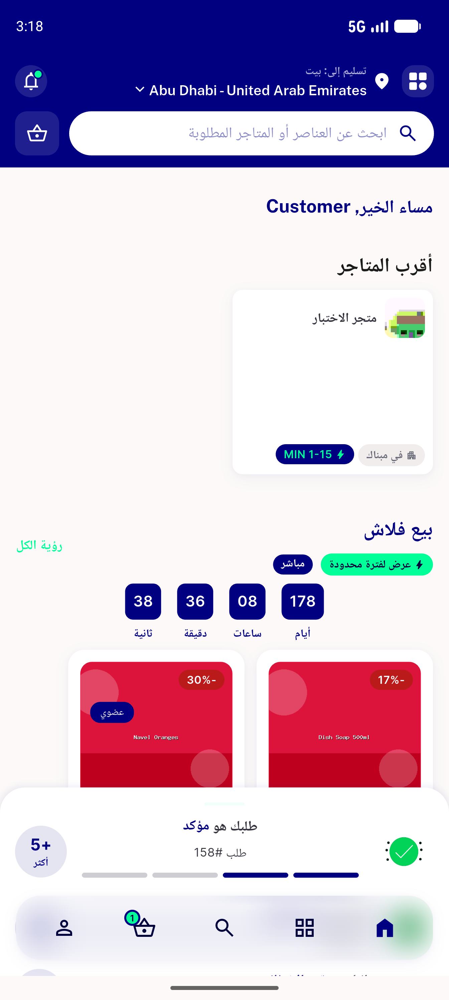

# QA Evidence — NEARS-1269

**PASS (cycle1 delta) _TowerStoreCard = android.widget.Button, content-desc=Test Store, clickable=true; tap->store details**

**4 screenshot(s).** Click any thumbnail for full resolution.

<table>
<tr>
<td align="center" width="33%"> postfix food new recommended rails</td>
<td align="center" width="33%"> postfix storecardwithdistance pharmacy button</td>
<td align="center" width="33%"> postfix tap navigates store details</td>
</tr>
<tr>
<td align="center" width="33%"> towerstorecard rail c1</td>
</tr>
</table>

### Other artifacts
- [`towerstorecard-node-c1.log`](towerstorecard-node-c1.log)
- [`uiautomator-node-evidence.txt`](uiautomator-node-evidence.txt)

---
*From `nears/docs/qa-evidence/NEARS-1269/` · public-repo scrub policy (no live secrets; verified clean).*
