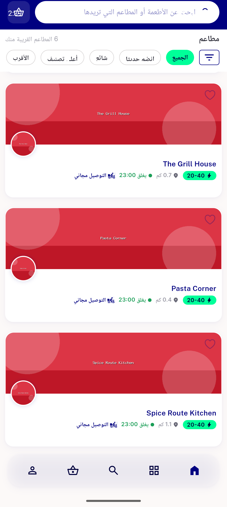
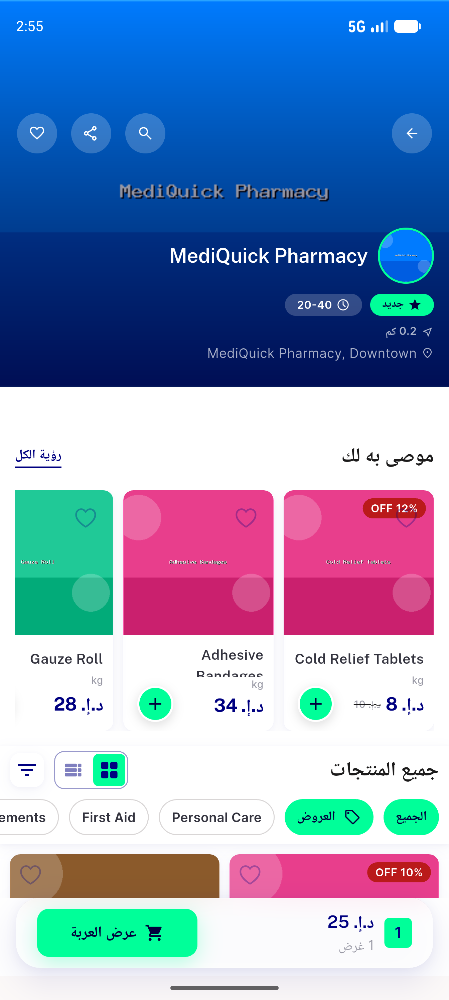

# QA Evidence — NEARS-1269

**PASS - 3/4 in-scope widgets device-proven Button+clickable; tap-nav preserved; logs clean**

**3 screenshot(s).** Click any thumbnail for full resolution.

<table>
<tr>
<td align="center" width="33%"> postfix food new recommended rails</td>
<td align="center" width="33%"> postfix storecardwithdistance pharmacy button</td>
<td align="center" width="33%"> postfix tap navigates store details</td>
</tr>
</table>

### Other artifacts
- [`uiautomator-node-evidence.txt`](uiautomator-node-evidence.txt)

---
*From `nears/docs/qa-evidence/NEARS-1269/` · public-repo scrub policy (no live secrets; verified clean).*
