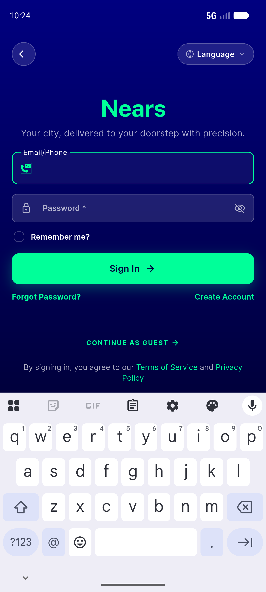
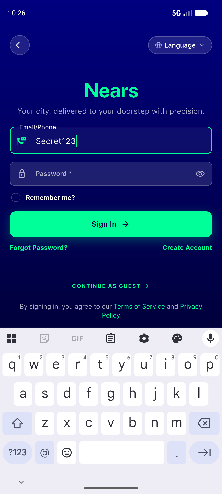
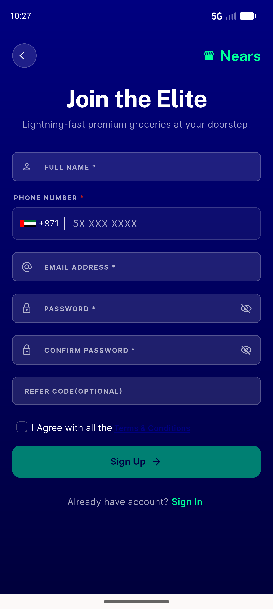

# QA Evidence — NEARS-1271

**PASS — NEARS-1271 NearsInput isRequired semantics: AC#1 green (7 semantics tests + R1 toggle-node), auth screens no visual/interaction regression, password toggles work, logs clean. AC#2 (TalkBack) deferred. emulator-5556.**

**3 screenshot(s).** Click any thumbnail for full resolution.

<table>
<tr>
<td align="center" width="33%"> login screen</td>
<td align="center" width="33%"> login password revealed</td>
<td align="center" width="33%"> signup screen</td>
</tr>
</table>

---
*From `nears/docs/qa-evidence/NEARS-1271/` · public-repo scrub policy (no live secrets; verified clean).*
