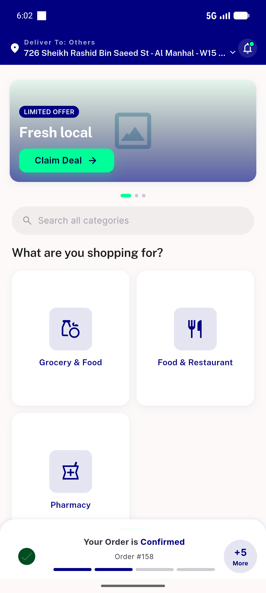
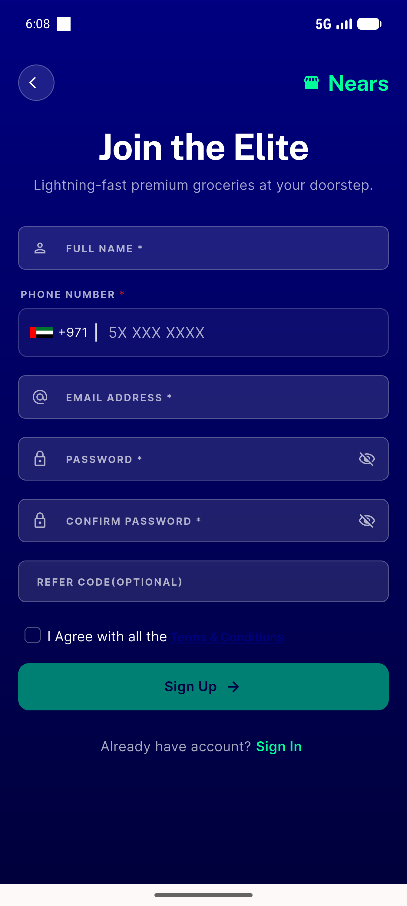
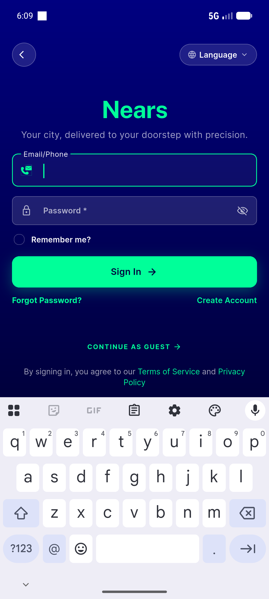
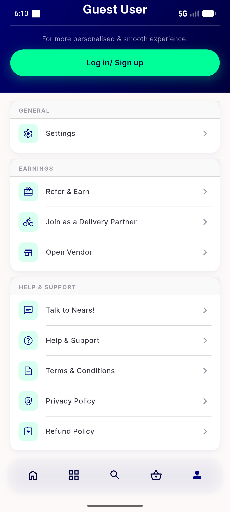

# QA Evidence — NEARS-1272

**PASS — sign-up renders, single back (HW + hero) returns cleanly, rapid double-back no crash/assertion, widget-test backstop green (2/2)**

**5 screenshot(s).** Click any thumbnail for full resolution.

<table>
<tr>
<td align="center" width="33%"> current state</td>
<td align="center" width="33%"> signup render</td>
<td align="center" width="33%"> after single hwback signin</td>
</tr>
<tr>
<td align="center" width="33%"> after heroback signin</td>
<td align="center" width="33%"> after rapid double back</td>
</tr>
</table>

---
*From `nears/docs/qa-evidence/NEARS-1272/` · public-repo scrub policy (no live secrets; verified clean).*
