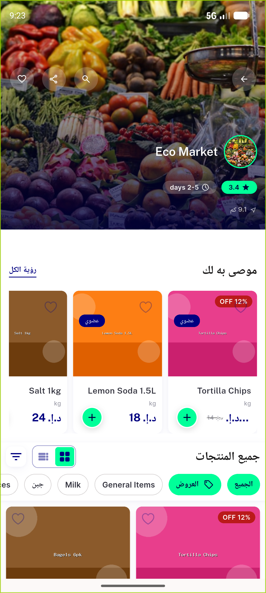
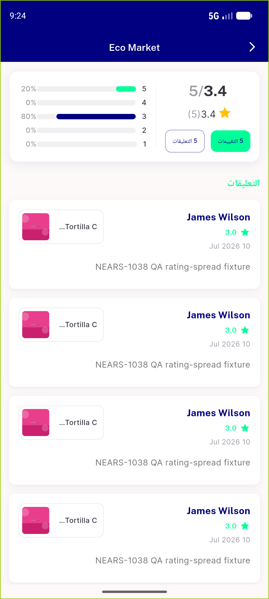
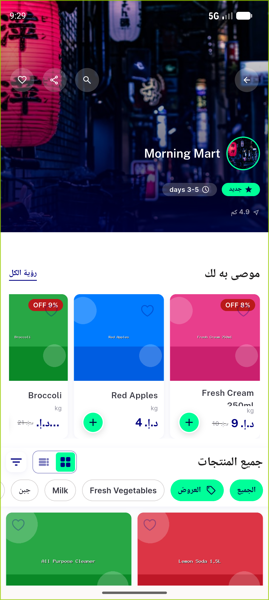
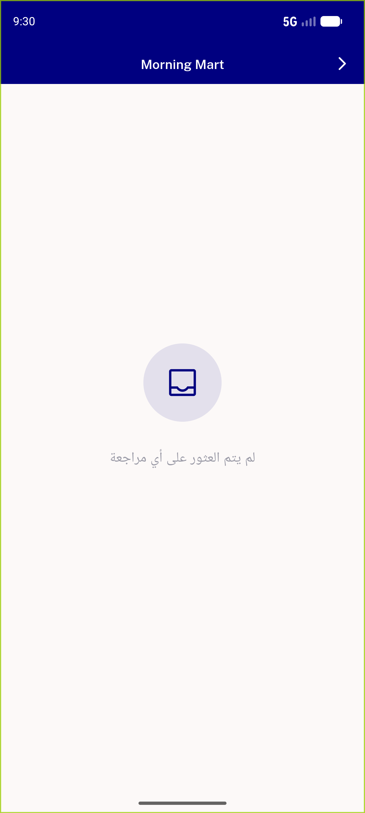

# QA Evidence — NEARS-1275

**PASS — rating pill navigates to Reviews (Android live; iOS best-effort parity)**

**4 screenshot(s).** Click any thumbnail for full resolution.

<table>
<tr>
<td align="center" width="33%"> ac1 01 before store header</td>
<td align="center" width="33%"> ac1 02 after reviews screen</td>
<td align="center" width="33%"> ac3 01 new store header</td>
</tr>
<tr>
<td align="center" width="33%"> ac3 02 new store reviews empty</td>
</tr>
</table>

### Other artifacts
- [`bug-checkout-distance-parse.log`](bug-checkout-distance-parse.log)
- [`ios-build-blocked-cocoapods.log`](ios-build-blocked-cocoapods.log)
- [`progress.md`](progress.md)

---
*From `nears/docs/qa-evidence/NEARS-1275/` · public-repo scrub policy (no live secrets; verified clean).*
