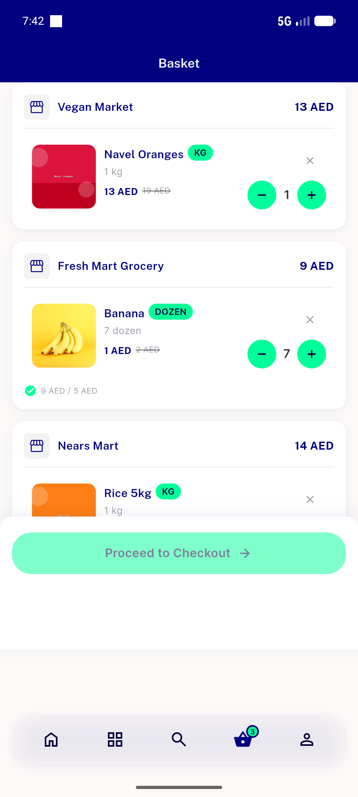
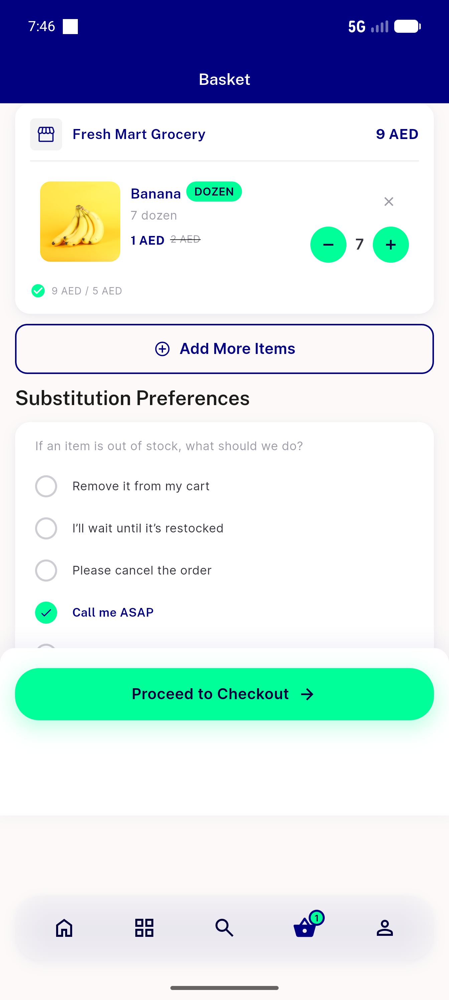
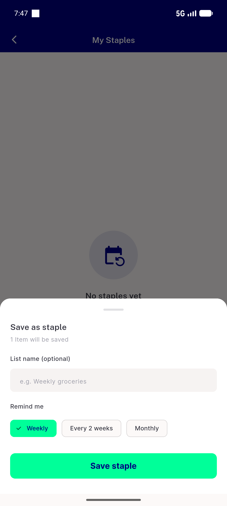
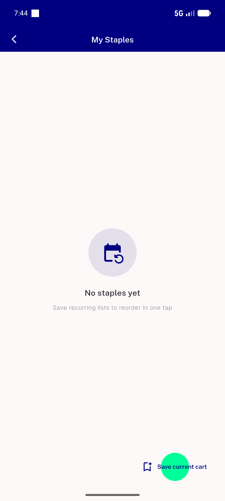
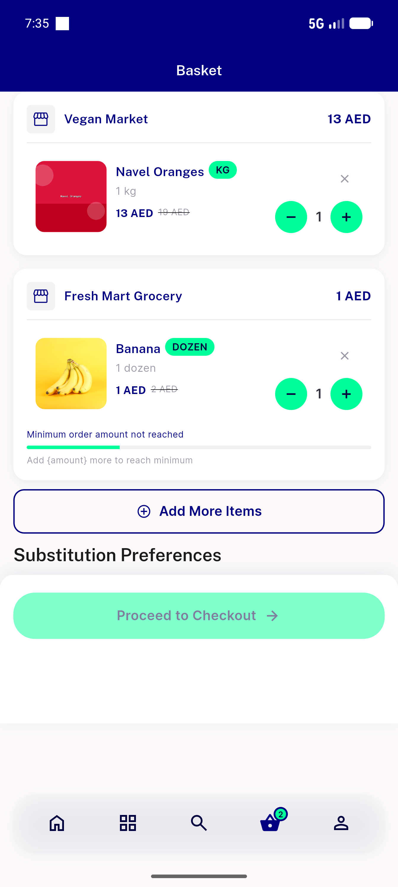
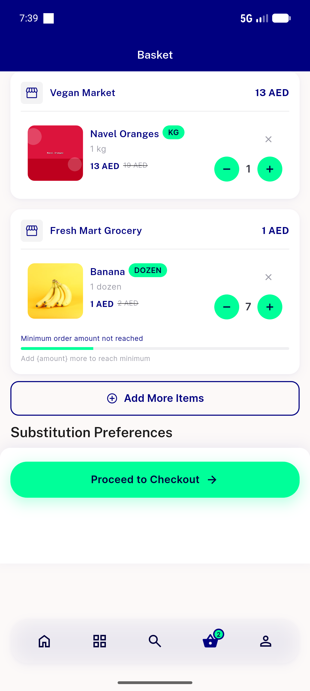
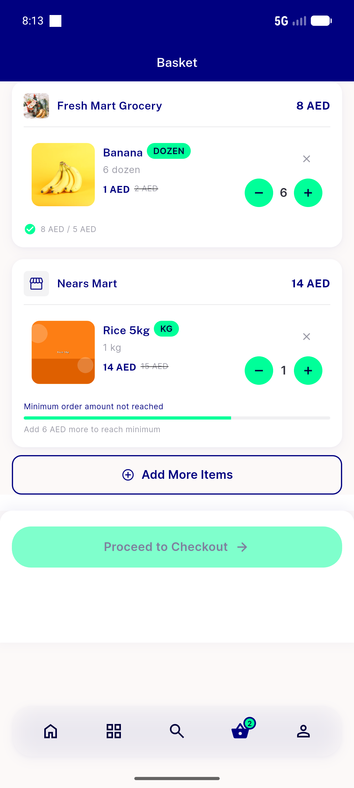
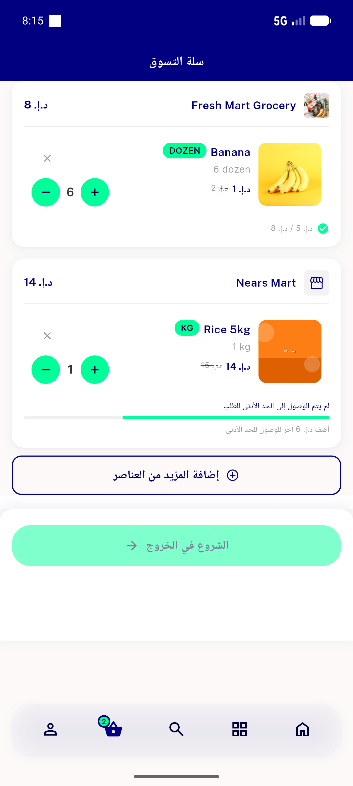
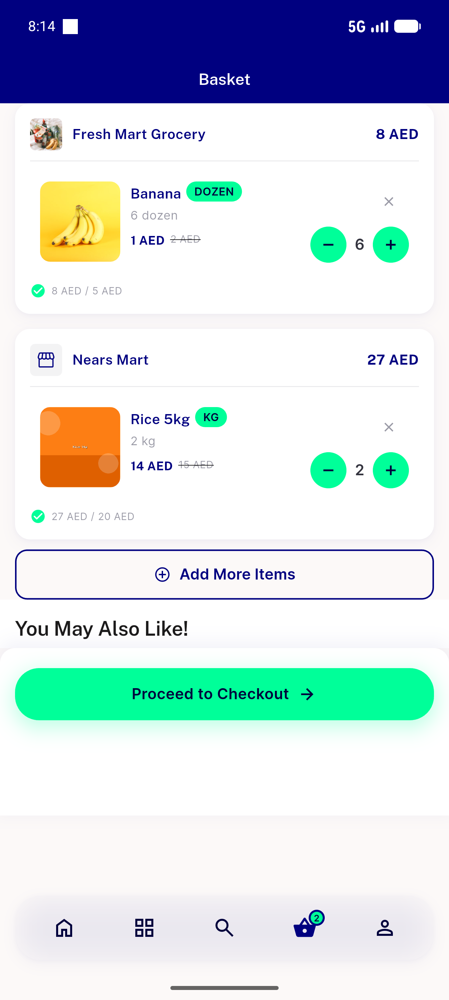

# QA Evidence — NEARS-1290

**PASS (delta re-QA cycle 2) — BUG A {amount} fixed (real amount EN+AR), BUG B stale section fixed (qty step updates subtotal+caption+CTA together both ways)**

**15 screenshot(s).** Click any thumbnail for full resolution.

<table>
<tr>
<td align="center" width="33%"> ac1 grouped 2stores</td>
<td align="center" width="33%"> ac2 three store sections</td>
<td align="center" width="33%"> ac3 single store n1</td>
</tr>
<tr>
<td align="center" width="33%"> ac4 empty cart</td>
<td align="center" width="33%"> ac5 nears mart below min cta disabled</td>
<td align="center" width="33%"> ac6 single store staple save sheet</td>
</tr>
<tr>
<td align="center" width="33%"> ac6 staple multistore blocked</td>
<td align="center" width="33%"> ac7 arabic rtl belowmin</td>
<td align="center" width="33%"> bug amount placeholder arabic</td>
</tr>
<tr>
<td align="center" width="33%"> bug amount placeholder unsubstituted</td>
<td align="center" width="33%"> bug stale subtotal minprogress</td>
<td align="center" width="33%"> cart after qty increase</td>
</tr>
<tr>
<td align="center" width="33%"> recheck ac1 bugA real amount en</td>
<td align="center" width="33%"> recheck ac7 bugA real amount arabic</td>
<td align="center" width="33%"> recheck bugB qtystep immediate consistent</td>
</tr>
</table>

### Other artifacts
- [`bug-staple-validation-logged-as-error.log`](bug-staple-validation-logged-as-error.log)
- [`note-outofzone-store17-403.log`](note-outofzone-store17-403.log)

---
*From `nears/docs/qa-evidence/NEARS-1290/` · public-repo scrub policy (no live secrets; verified clean).*
