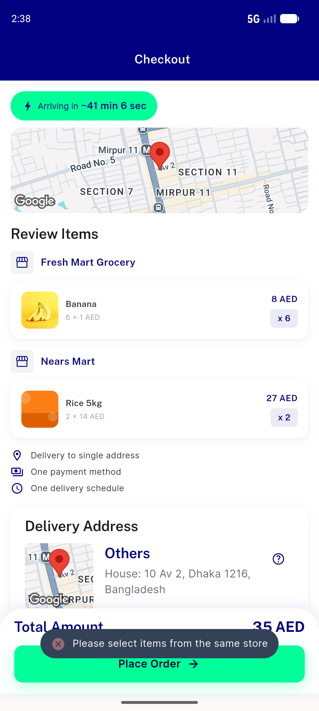
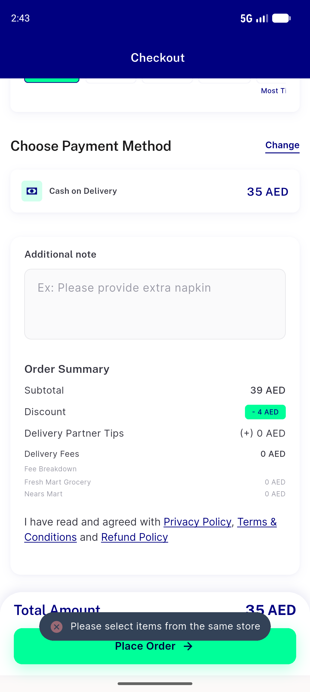

# QA Evidence — NEARS-1291

**FAIL — multi-store checkout get-Tax 403 infinite loop (HIGH); backend group contract + DB read-back PASS**

**2 screenshot(s).** Click any thumbnail for full resolution.

<table>
<tr>
<td align="center" width="33%"> ac1 checkout resectioned</td>
<td align="center" width="33%"> ac6 bill fees itemized</td>
</tr>
</table>

### Other artifacts
- [`ac3-db-readback.log`](ac3-db-readback.log)
- [`ac4-payment-group-id.log`](ac4-payment-group-id.log)
- [`bug-gettax-403-loop.log`](bug-gettax-403-loop.log)

---
*From `nears/docs/qa-evidence/NEARS-1291/` · public-repo scrub policy (no live secrets; verified clean).*
