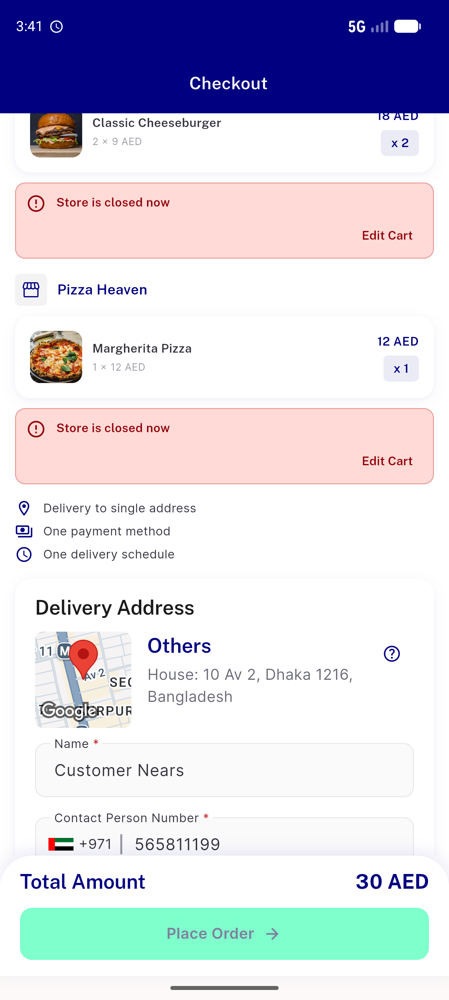
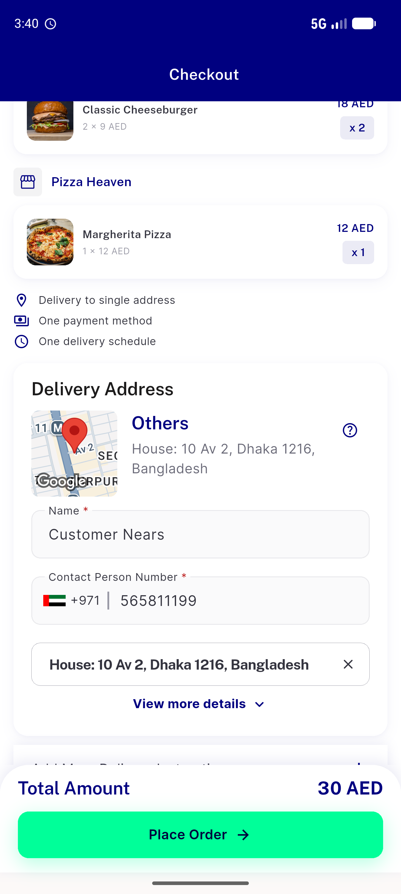

# QA Evidence — NEARS-1291

**PASS cycle-4: get-Tax 200 + item_type present, tax reconciles, no toast**

**2 screenshot(s).** Click any thumbnail for full resolution.

<table>
<tr>
<td align="center" width="33%"> ac2 store closed gate</td>
<td align="center" width="33%"> checkout bill 2store</td>
</tr>
</table>

### Other artifacts
- [`gettax-200-item_type-evidence.log`](gettax-200-item_type-evidence.log)

---
*From `nears/docs/qa-evidence/NEARS-1291/` · public-repo scrub policy (no live secrets; verified clean).*
