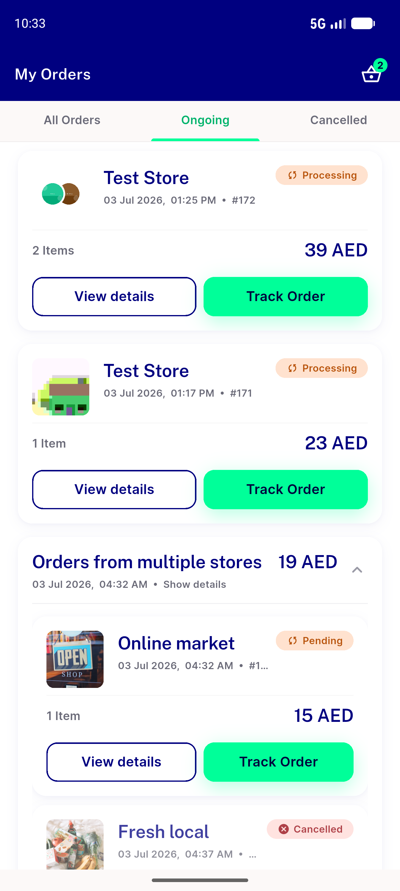
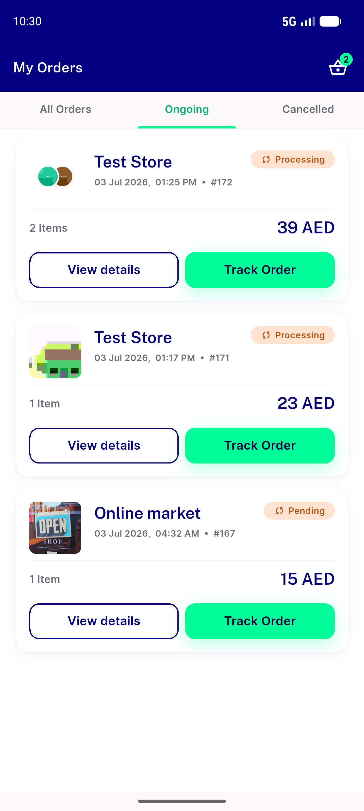
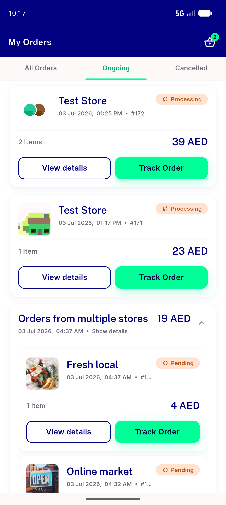
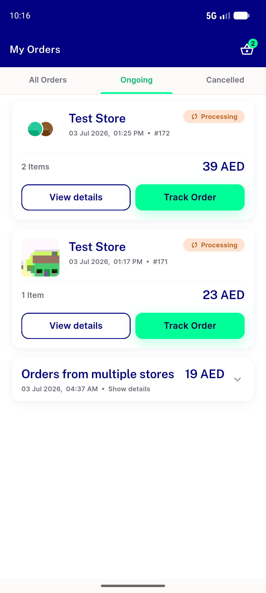
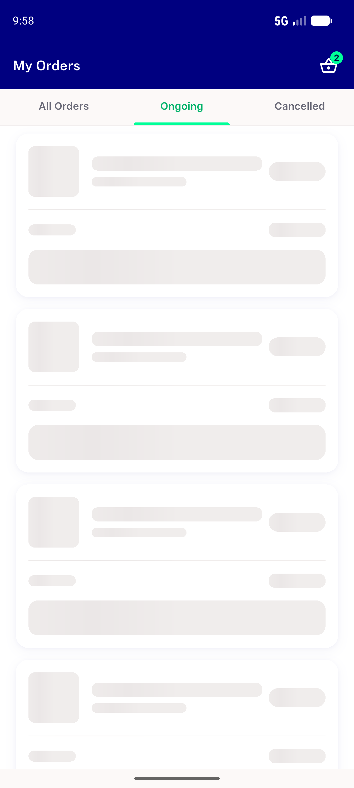
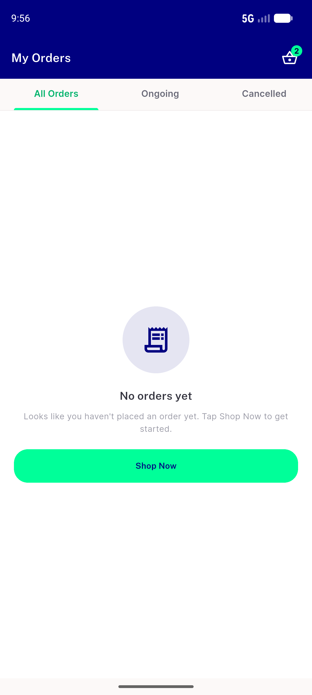
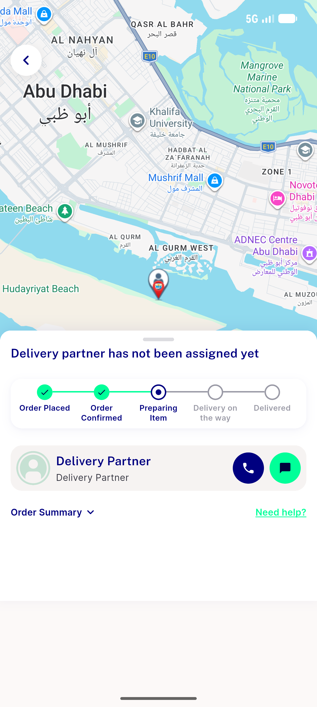

# QA Evidence — NEARS-1292

**RE-QA cycle 2 PASS — QA-01 parse crash FIXED; AC2/AC3/AC4/AC5 + regression demonstrated live; AC1/AC6 env-blocked**

**10 screenshot(s).** Click any thumbnail for full resolution.

<table>
<tr>
<td align="center" width="33%"> ac2 cr1 cancelled child terminal tone</td>
<td align="center" width="33%"> ac2 group tracking 0of2</td>
<td align="center" width="33%"> ac4 cr2 mixed group expanded</td>
</tr>
<tr>
<td align="center" width="33%"> ac4 cr2 mixed group ongoing</td>
<td align="center" width="33%"> ac4 group expanded</td>
<td align="center" width="33%"> ac4 ongoing group row</td>
</tr>
<tr>
<td align="center" width="33%"> bug ongoing tab empty</td>
<td align="center" width="33%"> bug orderlist typeerror empty</td>
<td align="center" width="33%"> orient home</td>
</tr>
<tr>
<td align="center" width="33%"> regression n1 single tracking</td>
</tr>
</table>

### Other artifacts
- [`bug-group-id-type-mismatch.log`](bug-group-id-type-mismatch.log)

---
*From `nears/docs/qa-evidence/NEARS-1292/` · public-repo scrub policy (no live secrets; verified clean).*
