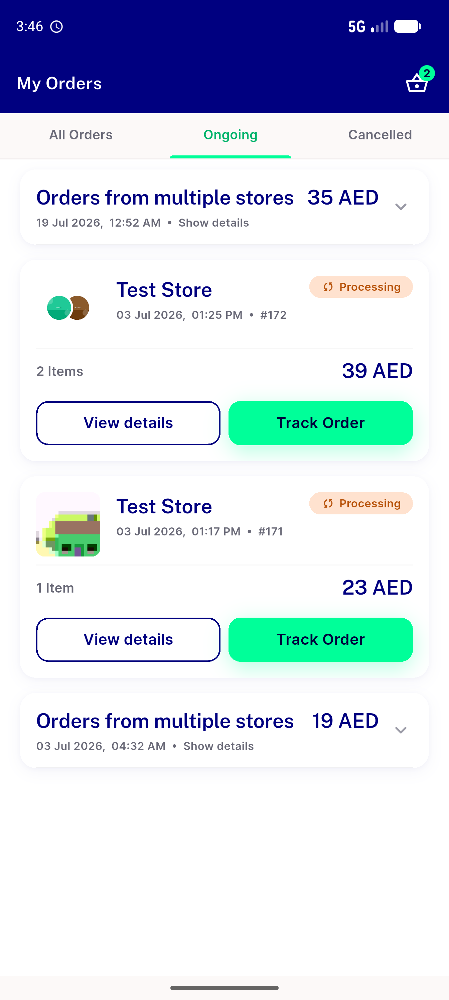
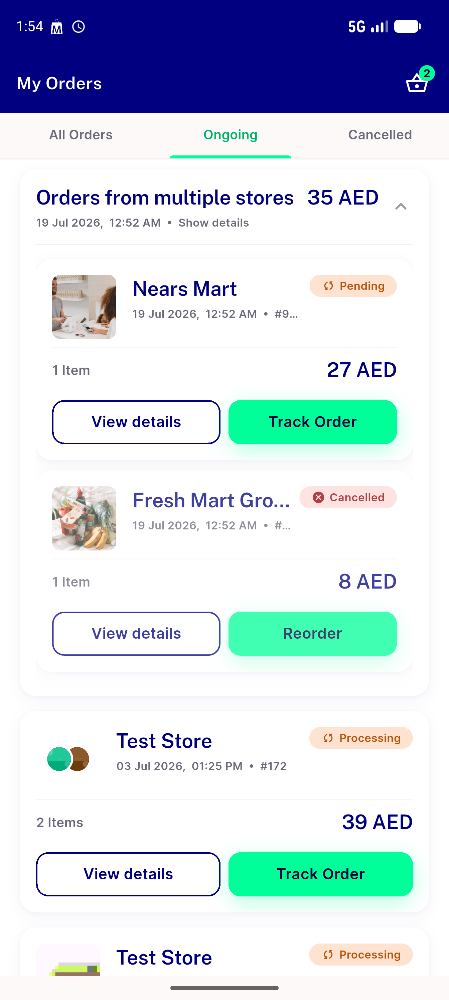
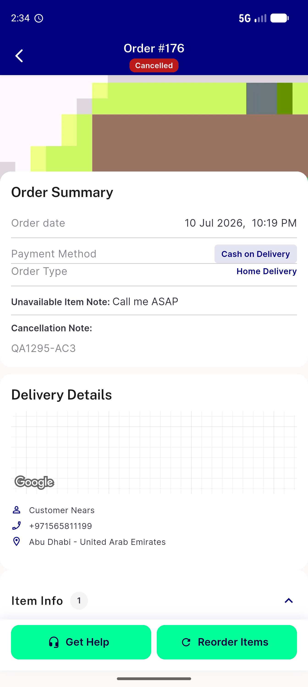

# QA Evidence — NEARS-1295

**PASS — AC1/AC2/AC3 verified live (isolated backend); grouped cancel keeps group intact + re-fetches both lists, single cancel no double-fetch**

**4 screenshot(s).** Click any thumbnail for full resolution.

<table>
<tr>
<td align="center" width="33%"> ongoing before cancel</td>
<td align="center" width="33%"> group intact after cancel 91110pending 91111cancelled</td>
<td align="center" width="33%"> isolated group intact 91110pending 91111cancelled</td>
</tr>
<tr>
<td align="center" width="33%"> single cancel 176 no double fetch</td>
</tr>
</table>

### Other artifacts
- [`ac2-grouped-cancel-both-refetch.log`](ac2-grouped-cancel-both-refetch.log)
- [`ac3-single-cancel-no-double-fetch.log`](ac3-single-cancel-no-double-fetch.log)
- [`bug-refund-applied-at-column-drift.log`](bug-refund-applied-at-column-drift.log)

---
*From `nears/docs/qa-evidence/NEARS-1295/` · public-repo scrub policy (no live secrets; verified clean).*
