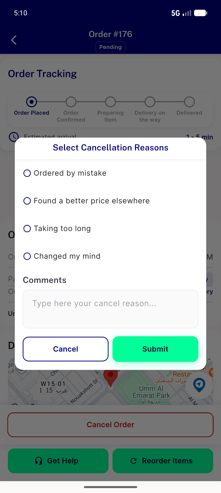
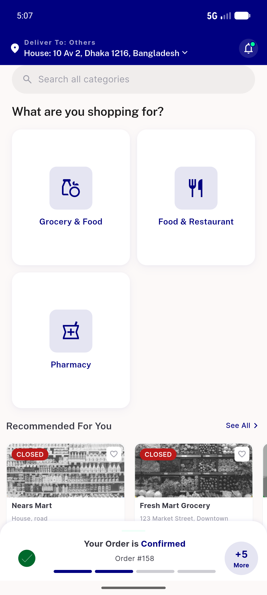
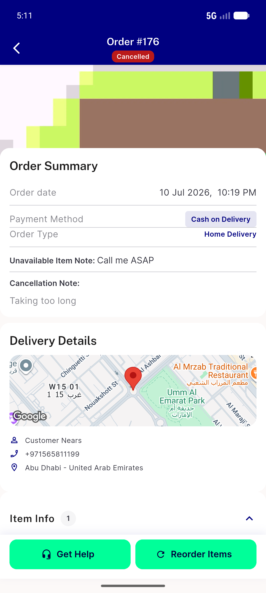

# QA Evidence — NEARS-1296

**AC2 PASS — customer order-cancel dialog lists 4 seeded reasons; Submit->cancel E2E (order 176 canceled)**

**3 screenshot(s).** Click any thumbnail for full resolution.

<table>
<tr>
<td align="center" width="33%"> cancel dialog reasons</td>
<td align="center" width="33%"> home banner</td>
<td align="center" width="33%"> order 176 cancelled</td>
</tr>
</table>

### Other artifacts
- [`progress.md`](progress.md)

---
*From `nears/docs/qa-evidence/NEARS-1296/` · public-repo scrub policy (no live secrets; verified clean).*
