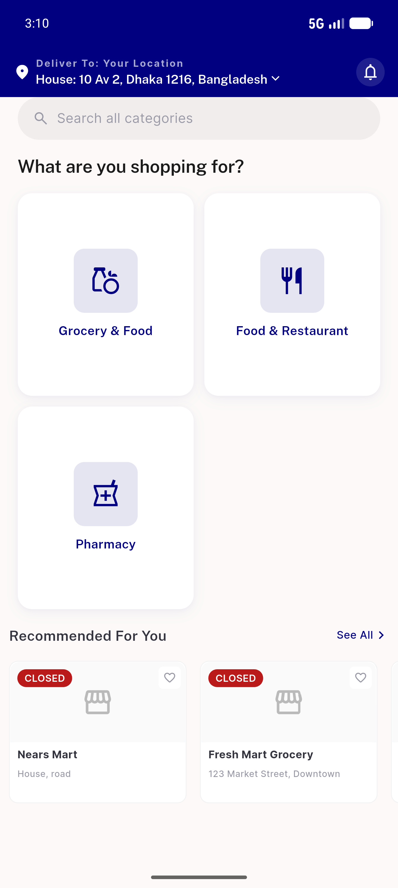

# QA Evidence — NEARS-1312

**PASS — guest_token secure-store + X-Guest-Token header transport verified live (UserApp+backend); migration OK**

**1 screenshot(s).** Click any thumbnail for full resolution.

<table>
<tr>
<td align="center" width="33%"> ac3 guest home migrated</td>
</tr>
</table>

### Other artifacts
- [`ac1-secure-storage.log`](ac1-secure-storage.log)
- [`ac2-middleware-differential.log`](ac2-middleware-differential.log)
- [`ac2-request-capture.log`](ac2-request-capture.log)
- [`migration-upgrade.log`](migration-upgrade.log)

---
*From `nears/docs/qa-evidence/NEARS-1312/` · public-repo scrub policy (no live secrets; verified clean).*
