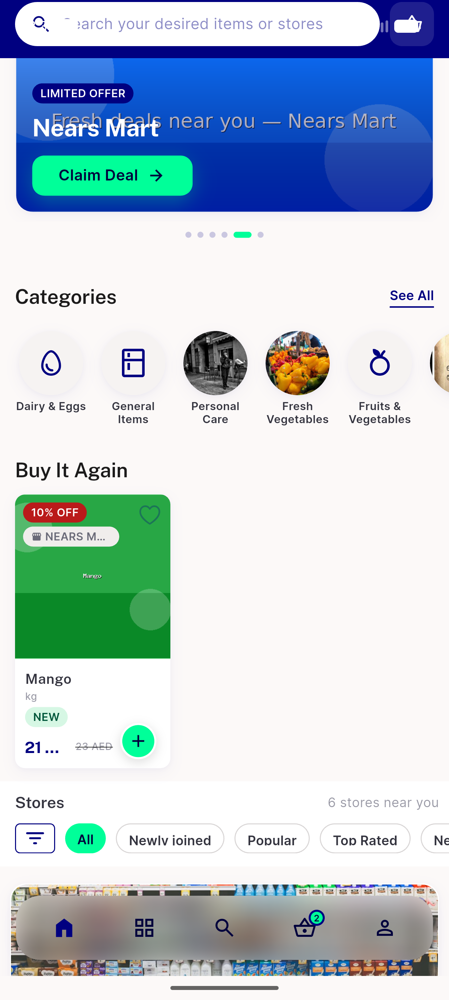
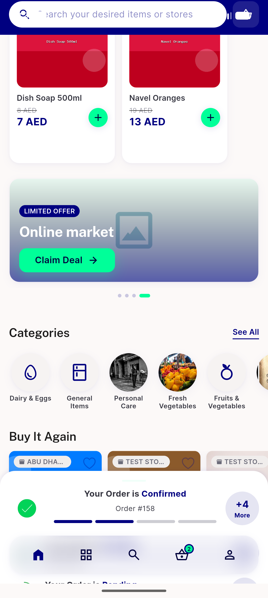
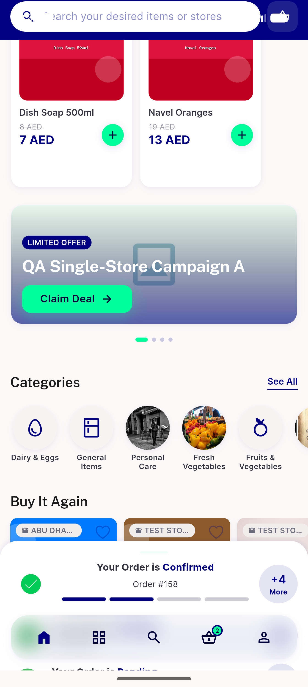

# QA Evidence — NEARS-1321

**cycle2 PASS — store-origin chip renders on Buy It Again (cycle-1 FAIL was an env artifact: wrong worktree/stale APK)**

**3 screenshot(s).** Click any thumbnail for full resolution.

<table>
<tr>
<td align="center" width="33%"> reqa c2 buyitagain mango chip</td>
<td align="center" width="33%"> reqa c2 buyitagain multistore z2 a</td>
<td align="center" width="33%"> reqa c2 buyitagain multistore z2 b</td>
</tr>
</table>

### Other artifacts
- [`progress.md`](progress.md)

---
*From `nears/docs/qa-evidence/NEARS-1321/` · public-repo scrub policy (no live secrets; verified clean).*
