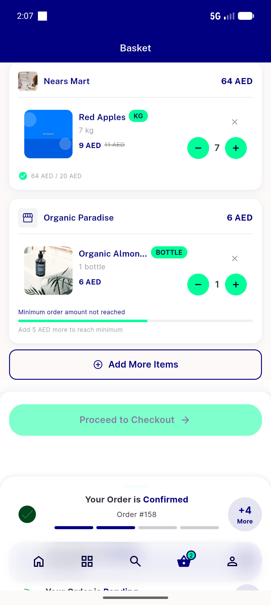

# QA Evidence — NEARS-1321

**FAIL — store-origin chip absent on live Buy It Again card (item has valid store_name); AC3 no-regression PASS**

**4 screenshot(s).** Click any thumbnail for full resolution.

<table>
<tr>
<td align="center" width="33%"> ac1 bia card no store chip</td>
<td align="center" width="33%"> ac2 buy it again rail</td>
<td align="center" width="33%"> ac3 category grid unchanged</td>
</tr>
<tr>
<td align="center" width="33%"> bug store origin chip missing on bia</td>
</tr>
</table>

### Other artifacts
- [`bug-store-origin-chip-missing-on-bia.log`](bug-store-origin-chip-missing-on-bia.log)

---
*From `nears/docs/qa-evidence/NEARS-1321/` · public-repo scrub policy (no live secrets; verified clean).*
