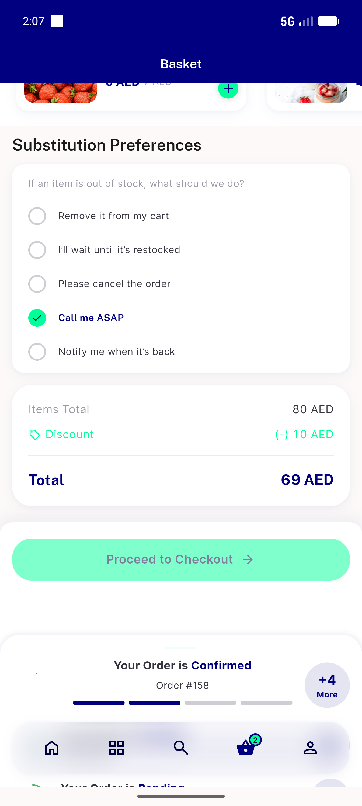
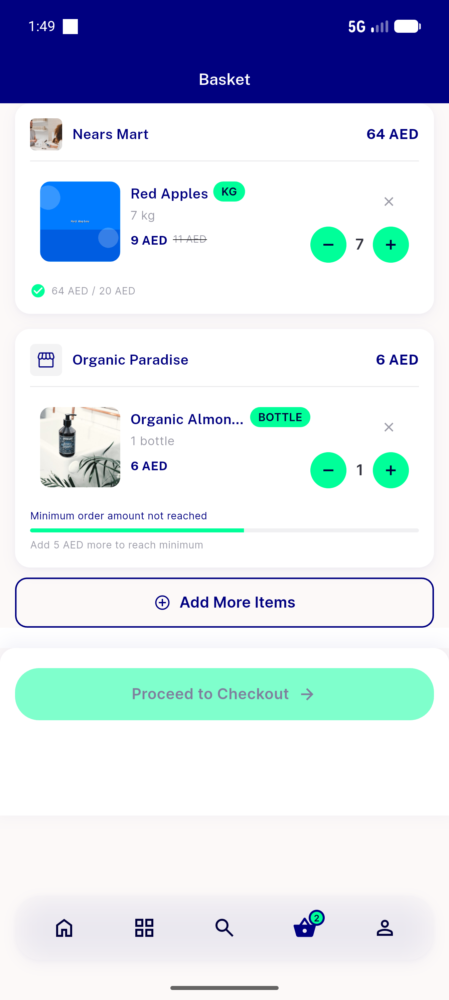
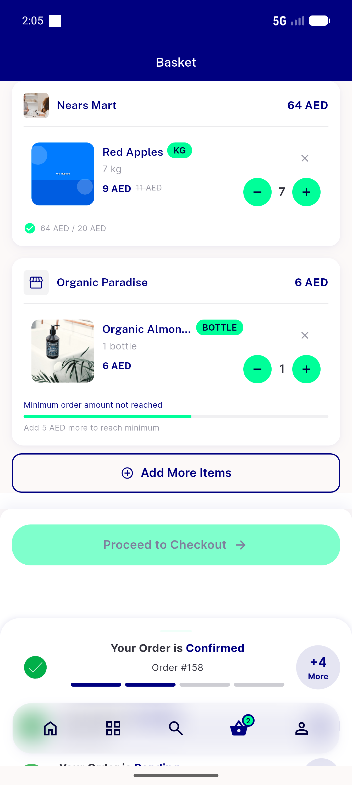

# QA Evidence — NEARS-1322

**QA: fix correct + rails healthy post-fix; pre-fix collapse not device-reproducible**

**4 screenshot(s).** Click any thumbnail for full resolution.

<table>
<tr>
<td align="center" width="33%"> postfix cart rails cards</td>
<td align="center" width="33%"> postfix cart rails rendered</td>
<td align="center" width="33%"> prefix cart atrest scroll2</td>
</tr>
<tr>
<td align="center" width="33%"> prefix cart atrest top</td>
</tr>
</table>

### Other artifacts
- [`postfix_AC1_AC2_twostore_widget_tree.txt`](postfix_AC1_AC2_twostore_widget_tree.txt)
- [`postfix_AC4_singlestore_widget_tree.txt`](postfix_AC4_singlestore_widget_tree.txt)
- [`postfix_widget_tree_rails.txt`](postfix_widget_tree_rails.txt)
- [`prefix_cart_atrest_uiautomator_dump.xml`](prefix_cart_atrest_uiautomator_dump.xml)
- [`prefix_cart_atrest_uiautomator_dump_session1.xml`](prefix_cart_atrest_uiautomator_dump_session1.xml)

---
*From `nears/docs/qa-evidence/NEARS-1322/` · public-repo scrub policy (no live secrets; verified clean).*
