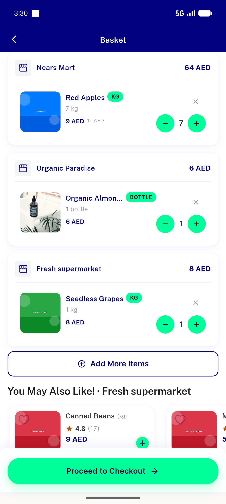
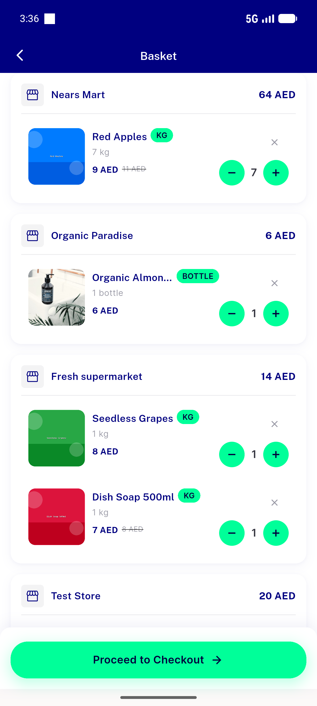
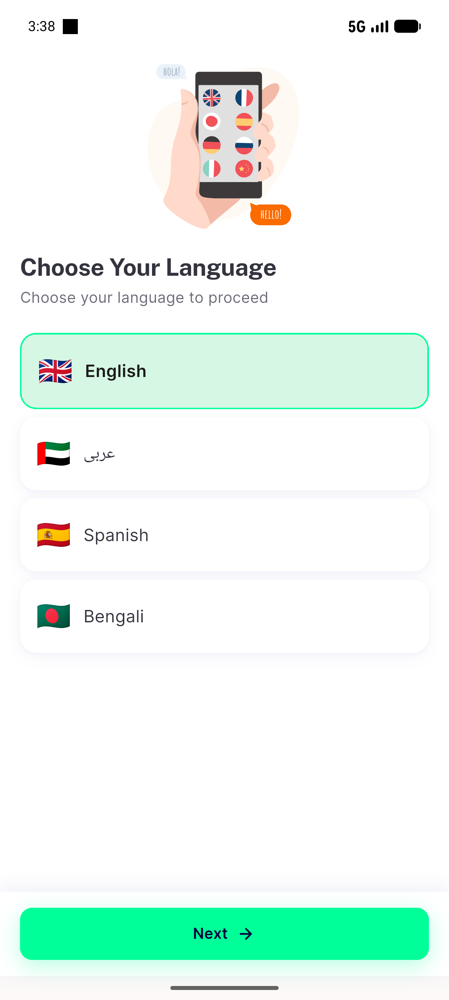

# QA Evidence — NEARS-1324

**PASS — NEARS-1324 state-preserving reconnect: attach preserves login+cart, package never uninstalled (emulator-5554)**

**3 screenshot(s).** Click any thumbnail for full resolution.

<table>
<tr>
<td align="center" width="33%"> baseline cart before</td>
<td align="center" width="33%"> cart after reconnect</td>
<td align="center" width="33%"> control fresh install onboarding</td>
</tr>
</table>

### Other artifacts
- [`A-control.log`](A-control.log)
- [`B-sequence.log`](B-sequence.log)
- [`bug-pkill-pattern-noop.log`](bug-pkill-pattern-noop.log)
- [`flutter-run-reinstall.log`](flutter-run-reinstall.log)
- [`flutter-run.log`](flutter-run.log)
- [`qa-reconnect.log`](qa-reconnect.log)

---
*From `nears/docs/qa-evidence/NEARS-1324/` · public-repo scrub policy (no live secrets; verified clean).*
