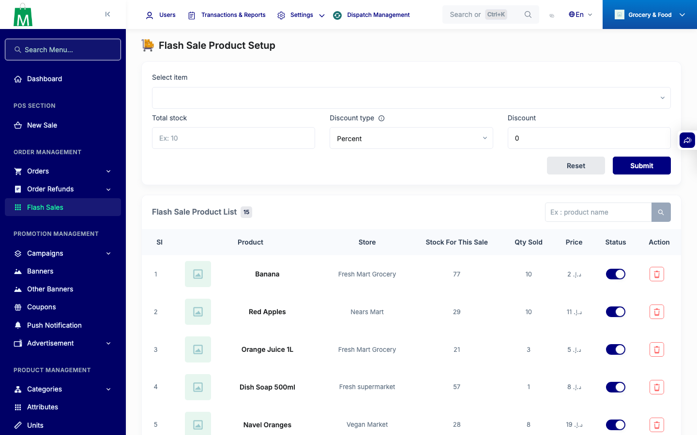
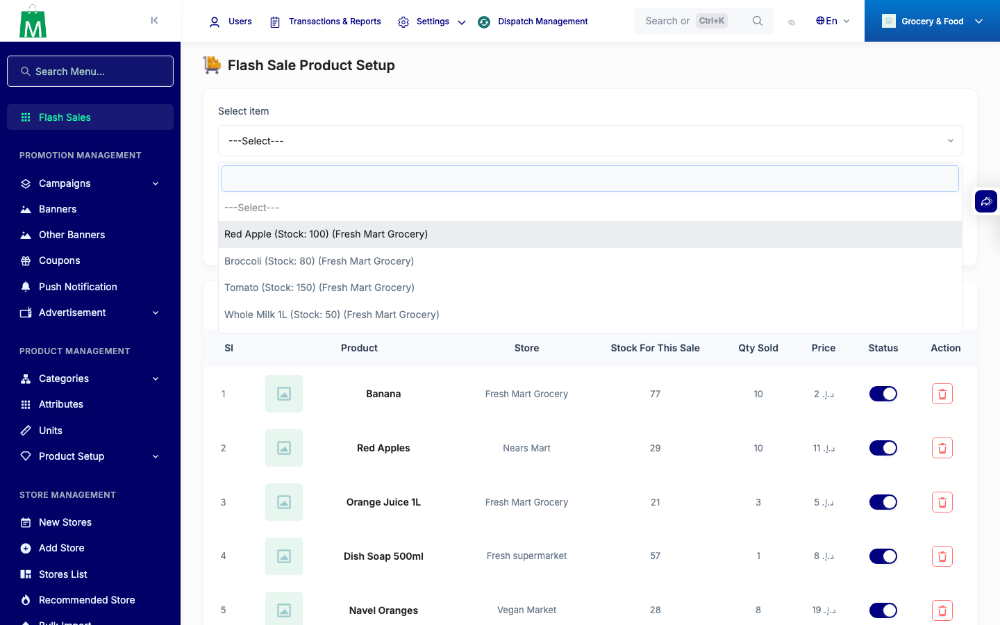

# QA Evidence — NEARS-1327

**PASS — flash-sale item picker OOM fixed: HTTP 200 + 14,890 options @128M, pre-fix OOMs, #choice_item populates 14,571**

**2 screenshot(s).** Click any thumbnail for full resolution.

<table>
<tr>
<td align="center" width="33%"> ac3 add product page</td>
<td align="center" width="33%"> ac3 choice item open</td>
</tr>
</table>

### Other artifacts
- [`ac1-ac2-api-evidence.log`](ac1-ac2-api-evidence.log)

---
*From `nears/docs/qa-evidence/NEARS-1327/` · public-repo scrub policy (no live secrets; verified clean).*
