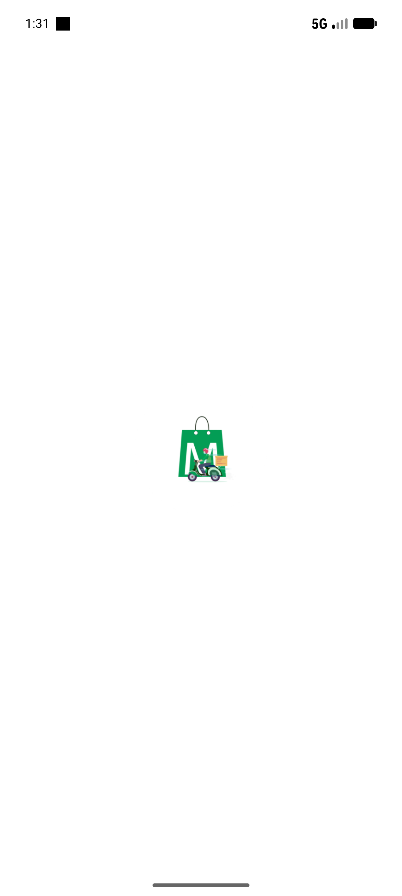
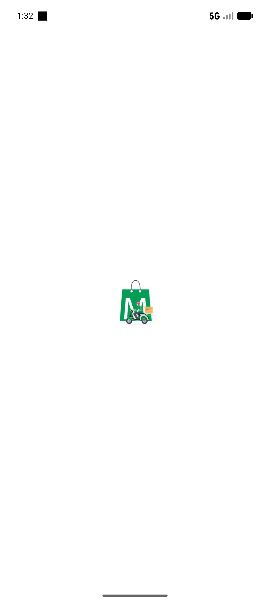
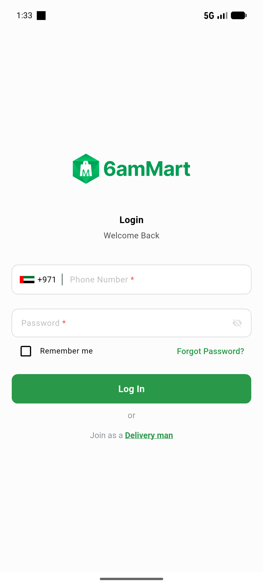
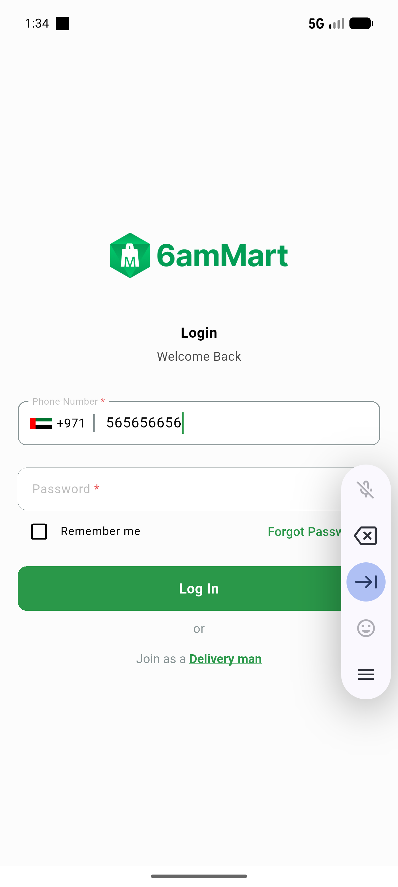
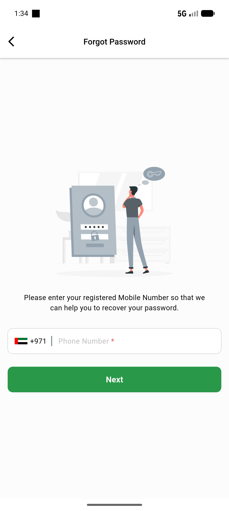
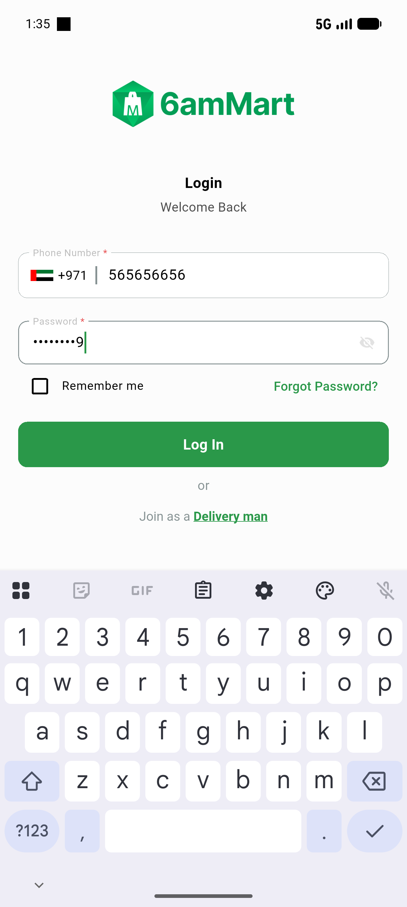
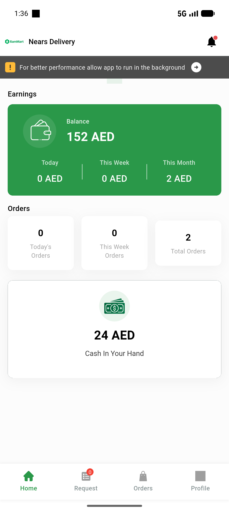
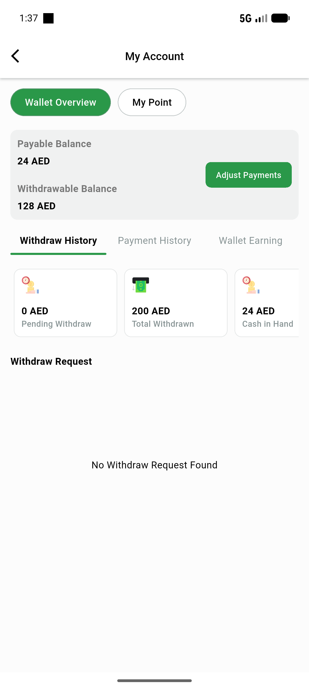

# QA Evidence — NEARS-1333

**PASS — withdraw_list envelope + disbursement SQL-aggregate verified live (empty-data path)**

**8 screenshot(s).** Click any thumbnail for full resolution.

<table>
<tr>
<td align="center" width="33%"> screen 01 current</td>
<td align="center" width="33%"> screen 02</td>
<td align="center" width="33%"> screen 03 login</td>
</tr>
<tr>
<td align="center" width="33%"> screen 04 filled</td>
<td align="center" width="33%"> screen 05 pw</td>
<td align="center" width="33%"> screen 06 ready</td>
</tr>
<tr>
<td align="center" width="33%"> screen 07 home</td>
<td align="center" width="33%"> screen 08 withdraw empty</td>
</tr>
</table>

### Other artifacts
- [`api-curl-evidence.log`](api-curl-evidence.log)

---
*From `nears/docs/qa-evidence/NEARS-1333/` · public-repo scrub policy (no live secrets; verified clean).*
