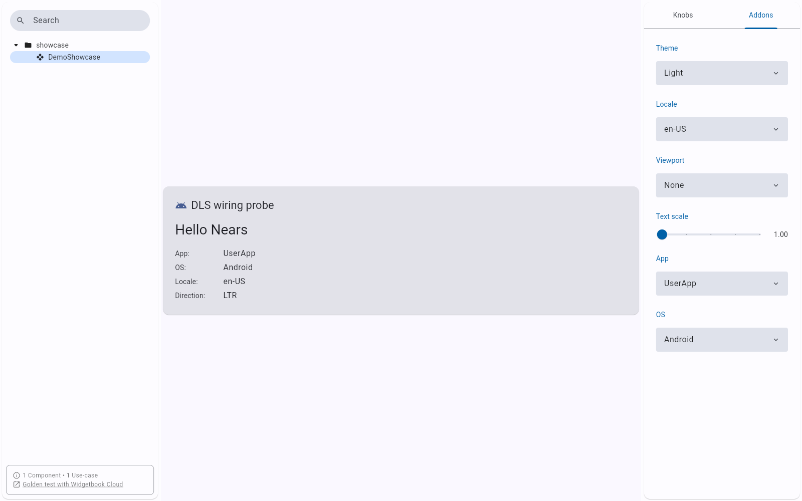
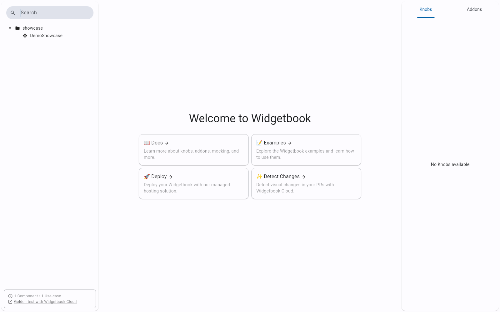
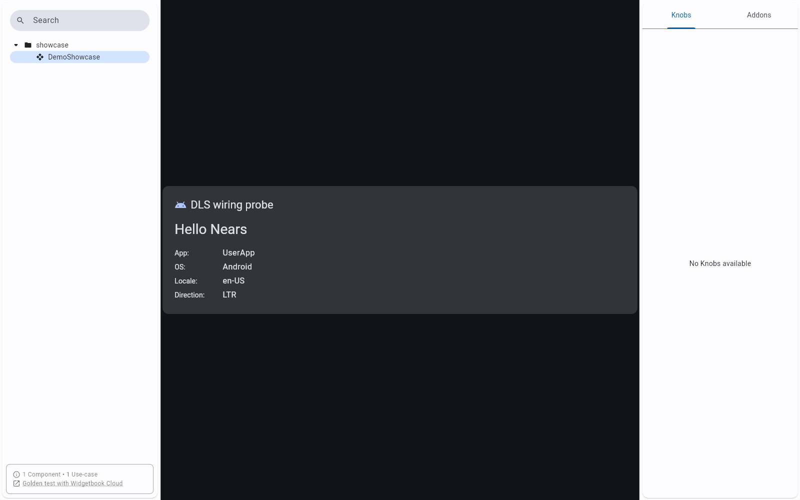
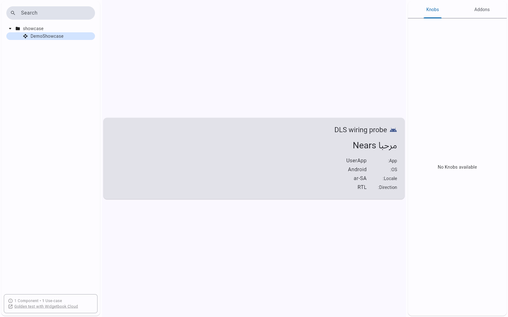
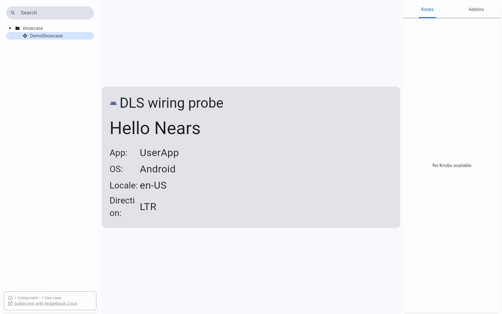
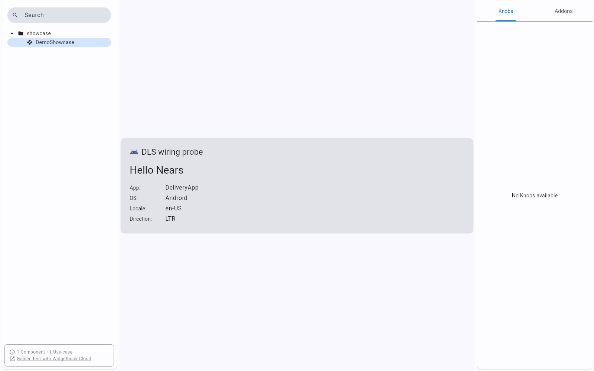
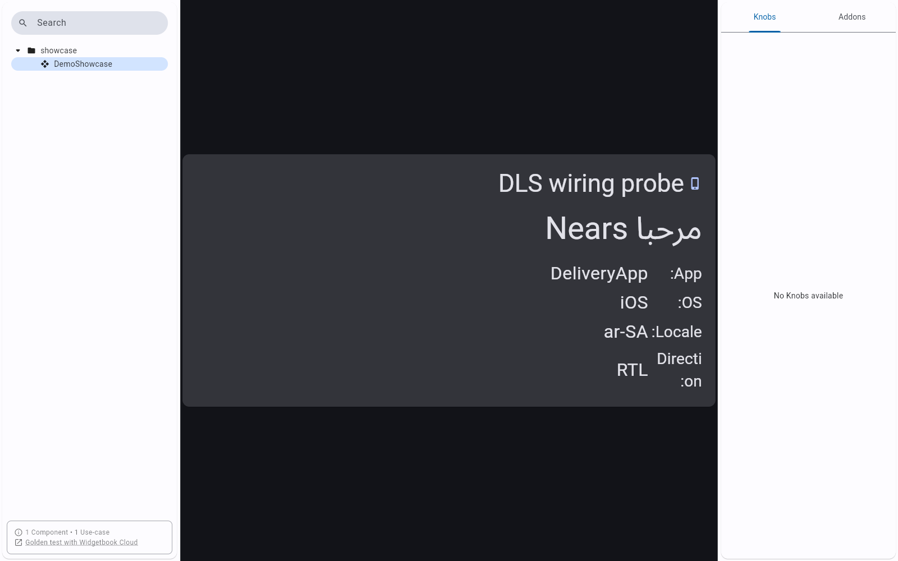
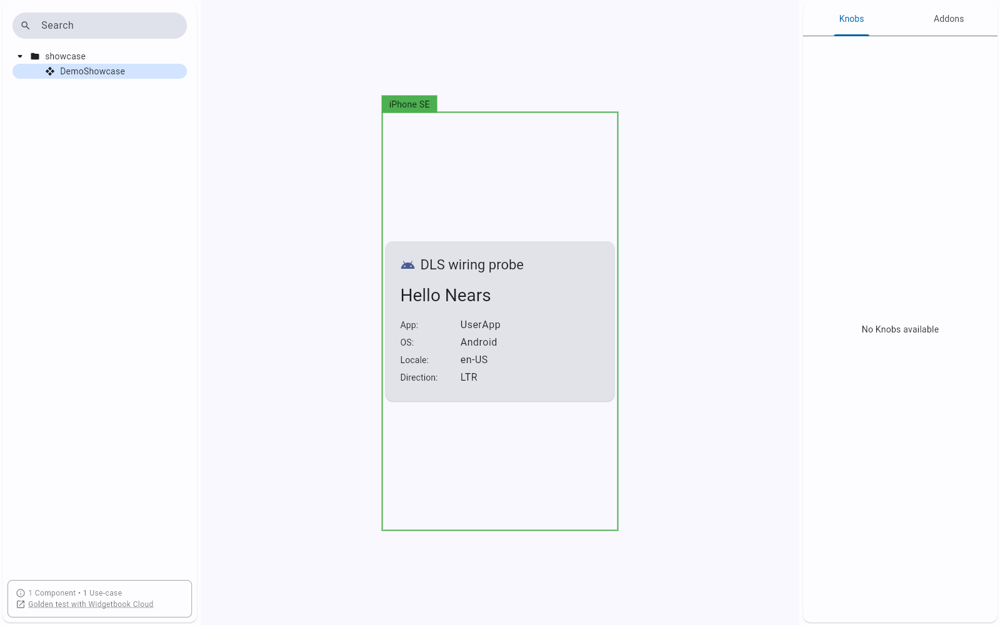

# QA Evidence — NEARS-1341

**PASS — DLS storybook: all 8 ACs verified live (Flutter web)**

**12 screenshot(s).** Click any thumbnail for full resolution.

<table>
<tr>
<td align="center" width="33%"> addons panel six controllers</td>
<td align="center" width="33%"> shell launch</td>
<td align="center" width="33%"> baseline light en userapp android</td>
</tr>
<tr>
<td align="center" width="33%"> dark theme</td>
<td align="center" width="33%"> locale ar rtl</td>
<td align="center" width="33%"> textscale 2x</td>
</tr>
<tr>
<td align="center" width="33%"> app deliveryapp</td>
<td align="center" width="33%"> app vendorapp</td>
<td align="center" width="33%"> os ios</td>
</tr>
<tr>
<td align="center" width="33%"> combo dark ar delivery ios 2x</td>
<td align="center" width="33%"> locale en ltr</td>
<td align="center" width="33%"> viewport iphone se</td>
</tr>
</table>

---
*From `nears/docs/qa-evidence/NEARS-1341/` · public-repo scrub policy (no live secrets; verified clean).*
