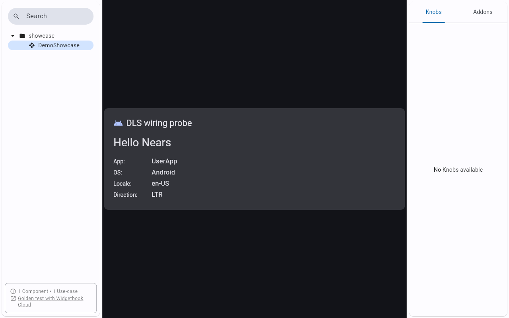
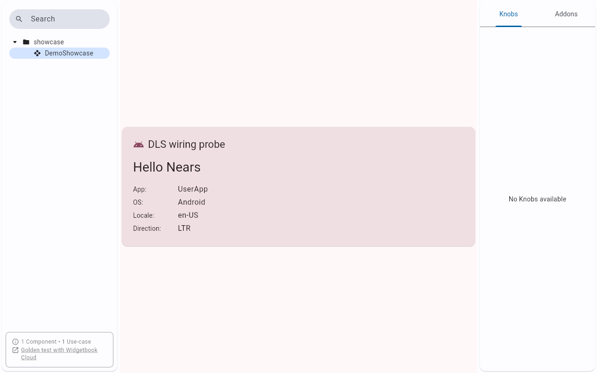
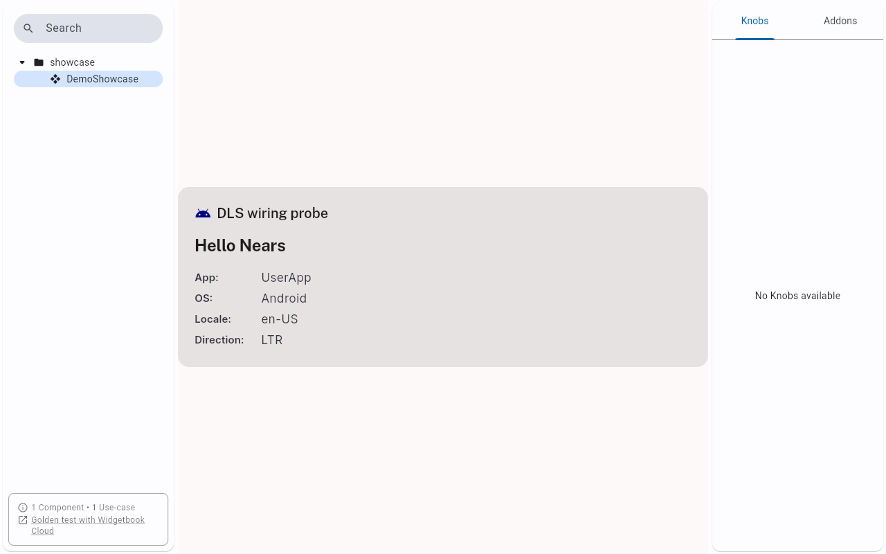
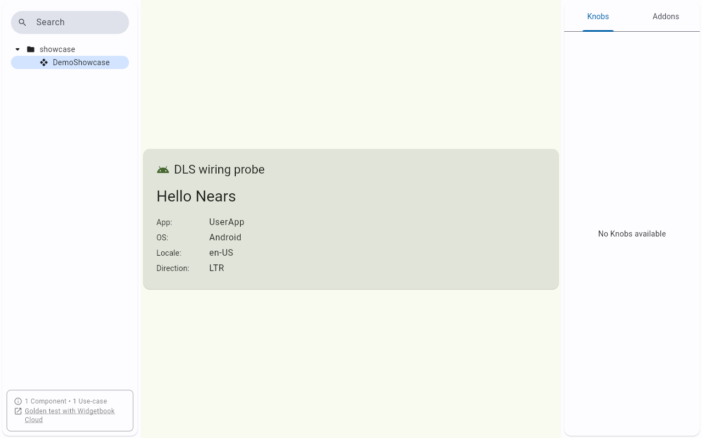
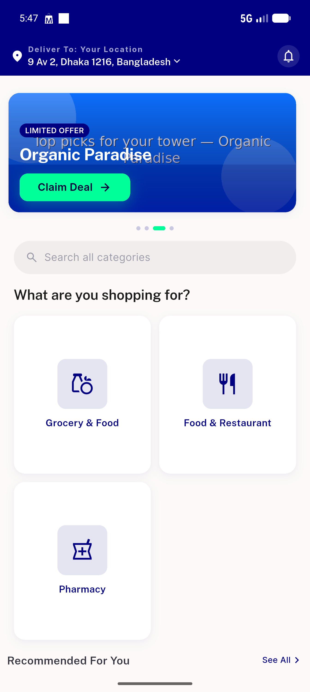
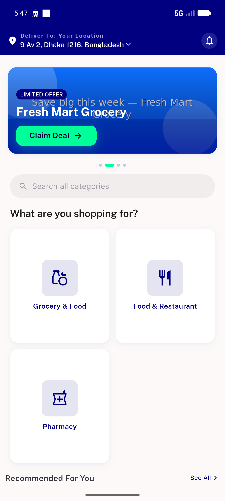
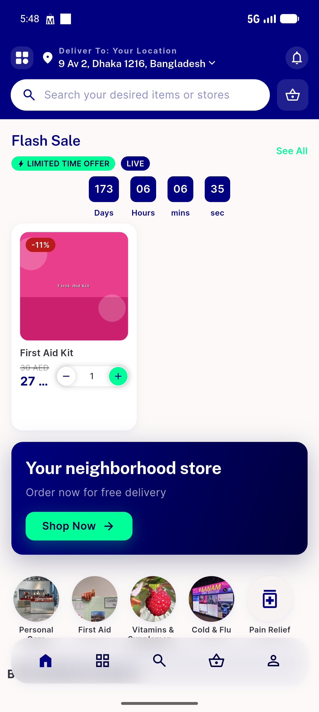
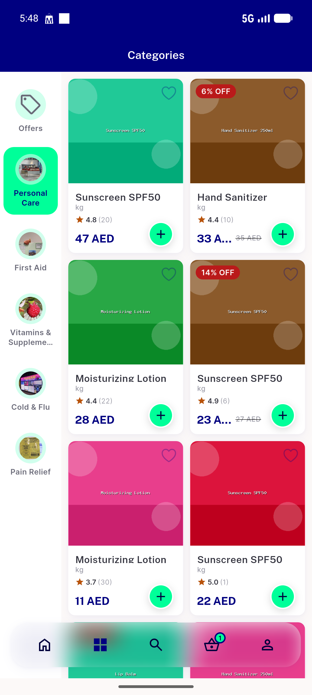
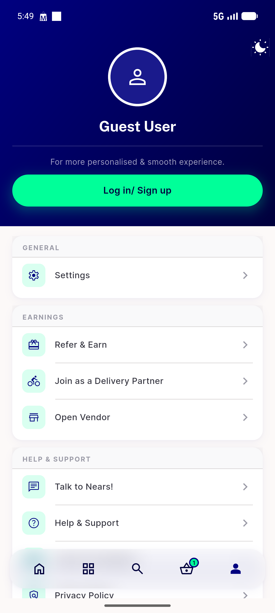

# QA Evidence — NEARS-1345

**PASS — F3 token move: UserApp boots+renders themed, storybook Light=real navy #000080, dark/Delivery/Vendor placeholders switch**

**10 screenshot(s).** Click any thumbnail for full resolution.

<table>
<tr>
<td align="center" width="33%"> storybook Dark</td>
<td align="center" width="33%"> storybook DeliveryApp</td>
<td align="center" width="33%"> storybook Light</td>
</tr>
<tr>
<td align="center" width="33%"> storybook VendorApp</td>
<td align="center" width="33%"> userapp 01 home</td>
<td align="center" width="33%"> userapp 02 store</td>
</tr>
<tr>
<td align="center" width="33%"> userapp 03 module or category</td>
<td align="center" width="33%"> userapp 04 cart</td>
<td align="center" width="33%"> userapp 05 categories</td>
</tr>
<tr>
<td align="center" width="33%"> userapp 06 profile</td>
</tr>
</table>

---
*From `nears/docs/qa-evidence/NEARS-1345/` · public-repo scrub policy (no live secrets; verified clean).*
