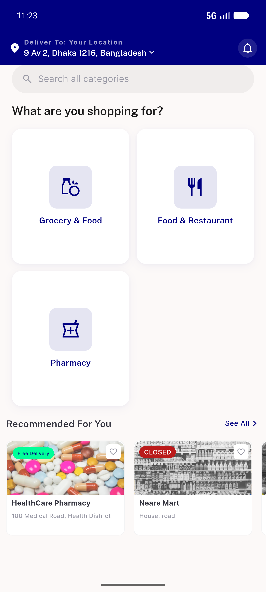
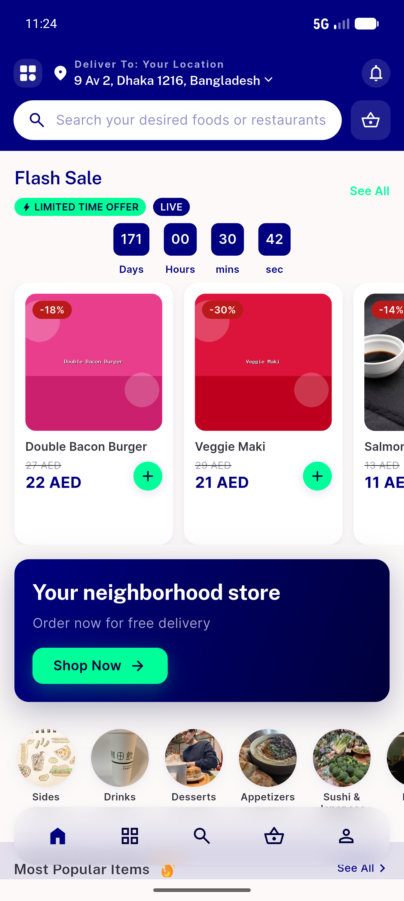
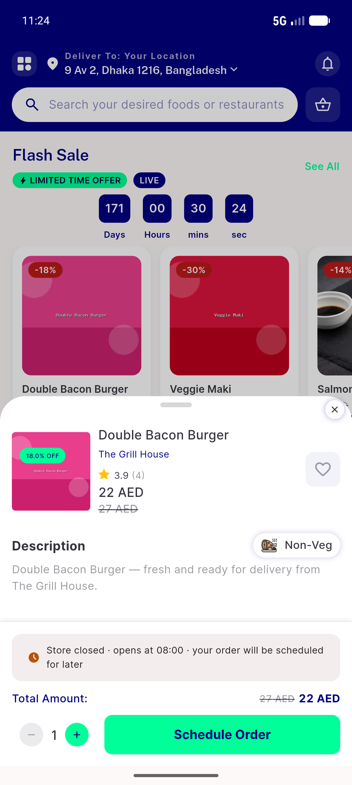
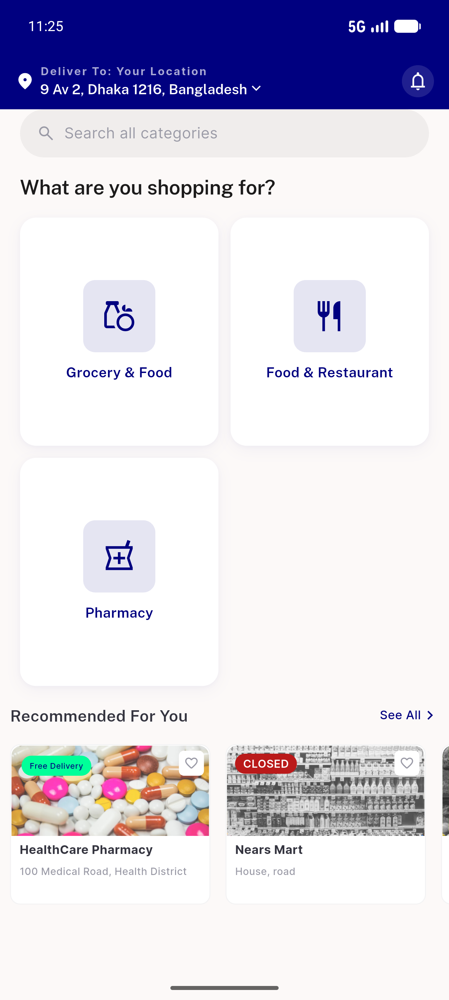
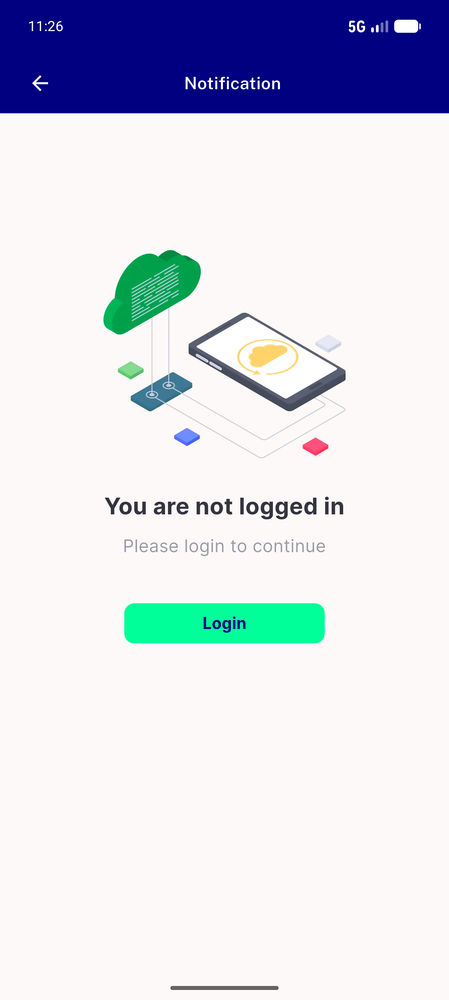
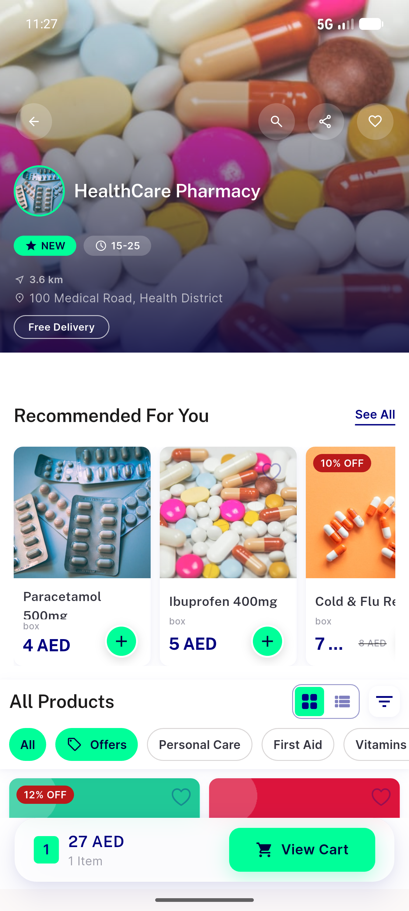
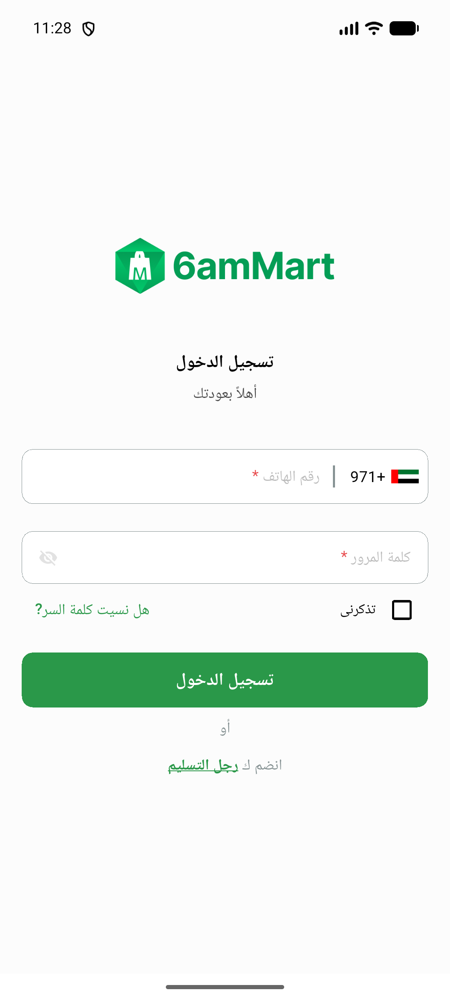
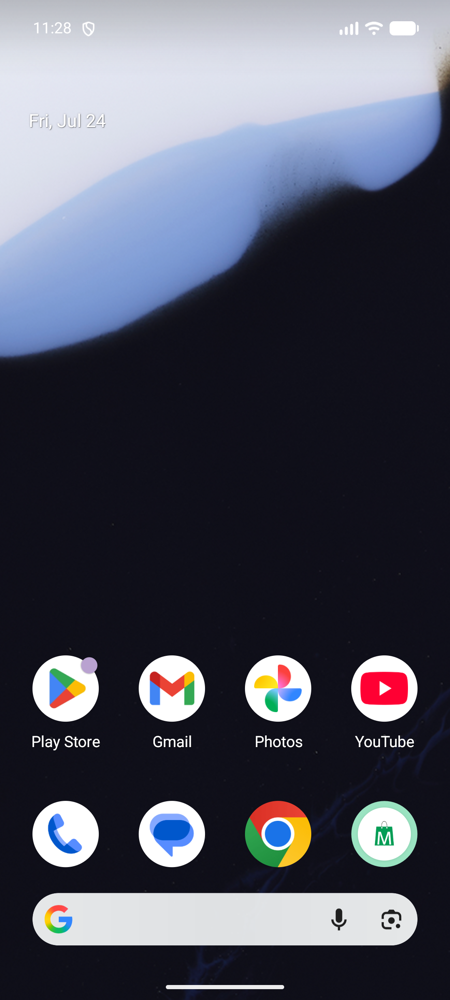
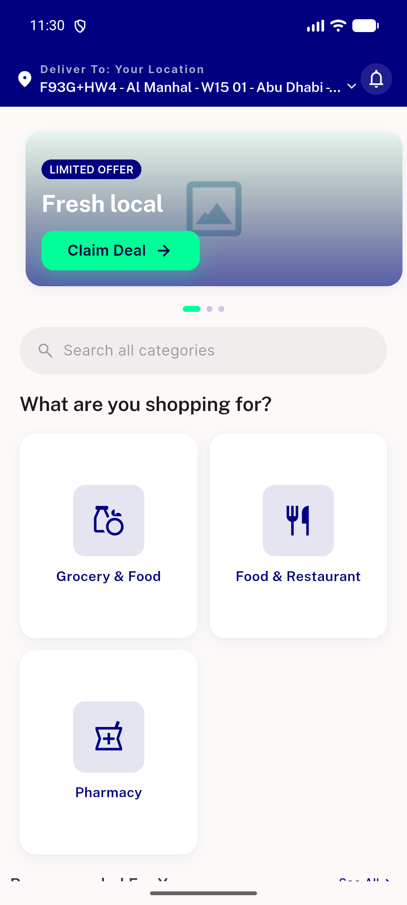
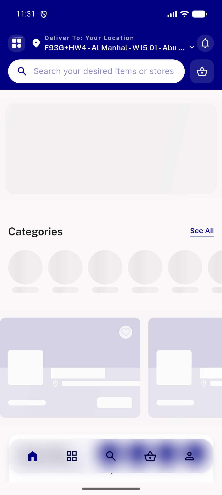

# QA Evidence — NEARS-1347

**PASS — NIcon move render-identical across UserApp; 0 icon errors; 35/35+361/361 green**

**10 screenshot(s).** Click any thumbnail for full resolution.

<table>
<tr>
<td align="center" width="33%"> home light</td>
<td align="center" width="33%"> store list</td>
<td align="center" width="33%"> item detail</td>
</tr>
<tr>
<td align="center" width="33%"> profile menu</td>
<td align="center" width="33%"> notification</td>
<td align="center" width="33%"> store detail</td>
</tr>
<tr>
<td align="center" width="33%"> rtl signin</td>
<td align="center" width="33%"> rtl home</td>
<td align="center" width="33%"> home 5556 abudhabi</td>
</tr>
<tr>
<td align="center" width="33%"> module 5556</td>
</tr>
</table>

### Other artifacts
- [`progress.md`](progress.md)

---
*From `nears/docs/qa-evidence/NEARS-1347/` · public-repo scrub policy (no live secrets; verified clean).*
