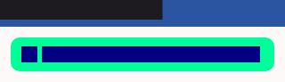

# QA Evidence — NEARS-1348

**PASS — NSpeedBanner F4 migration, golden oracle pixel-identity (default/dark/rtl), 399 pkg tests green**

**3 screenshot(s).** Click any thumbnail for full resolution.

<table>
<tr>
<td align="center" width="33%"> golden dark</td>
<td align="center" width="33%"> golden default light</td>
<td align="center" width="33%"> golden rtl</td>
</tr>
</table>

---
*From `nears/docs/qa-evidence/NEARS-1348/` · public-repo scrub policy (no live secrets; verified clean).*
