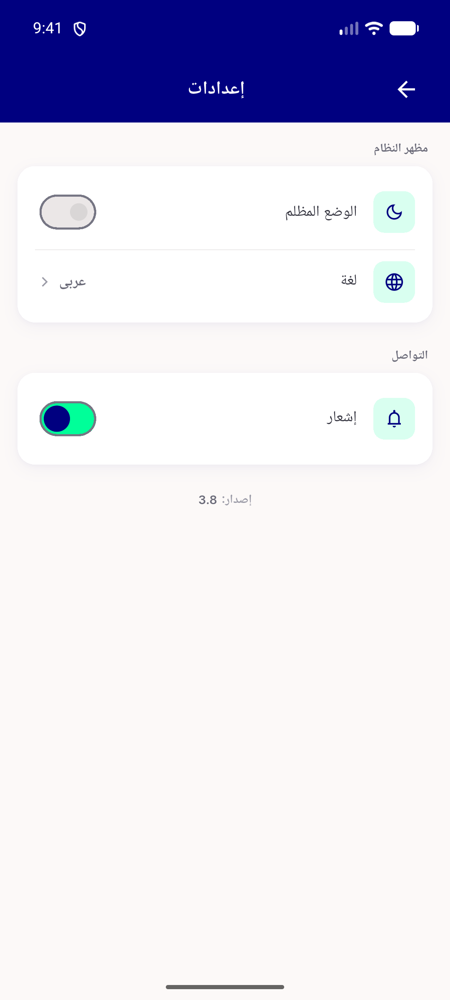
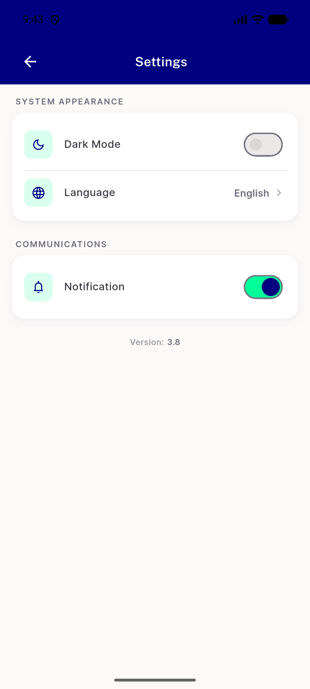
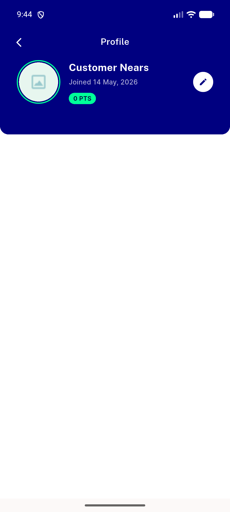
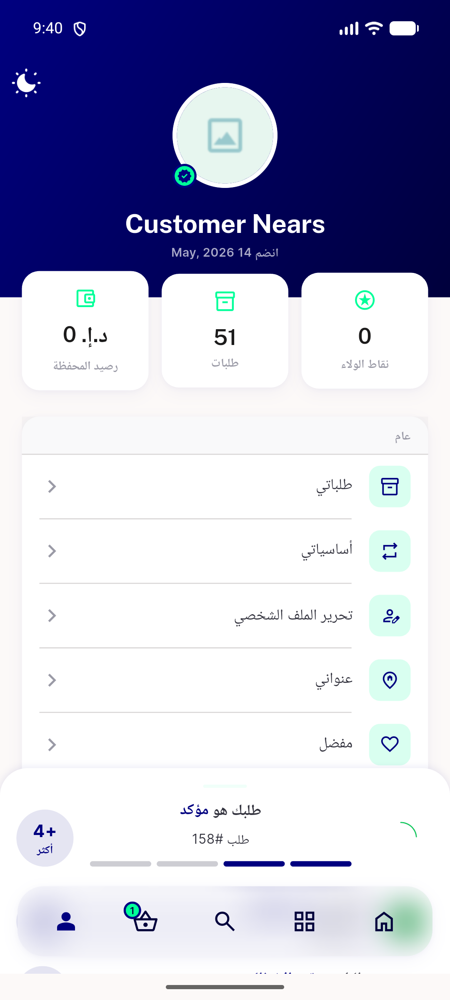
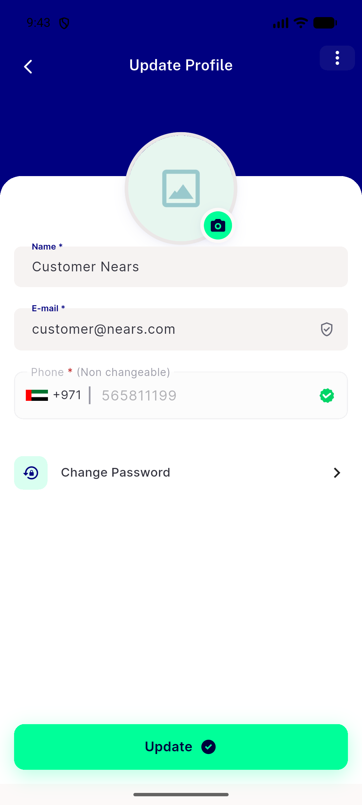

# QA Evidence — NEARS-1349

**PASS — NSettingsTile verbatim move; 3/5 surfaces live, badge+dark golden-verified**

**6 screenshot(s).** Click any thumbnail for full resolution.

<table>
<tr>
<td align="center" width="33%"> setting page 5556</td>
<td align="center" width="33%"> setting page en 5556</td>
<td align="center" width="33%"> profile screen after load</td>
</tr>
<tr>
<td align="center" width="33%"> profile screen deeplink 5556</td>
<td align="center" width="33%"> menu screen rtl 5556</td>
<td align="center" width="33%"> update profile change pw 5556</td>
</tr>
</table>

---
*From `nears/docs/qa-evidence/NEARS-1349/` · public-repo scrub policy (no live secrets; verified clean).*
