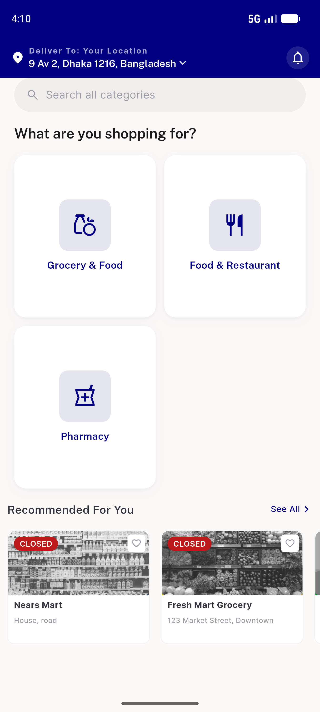
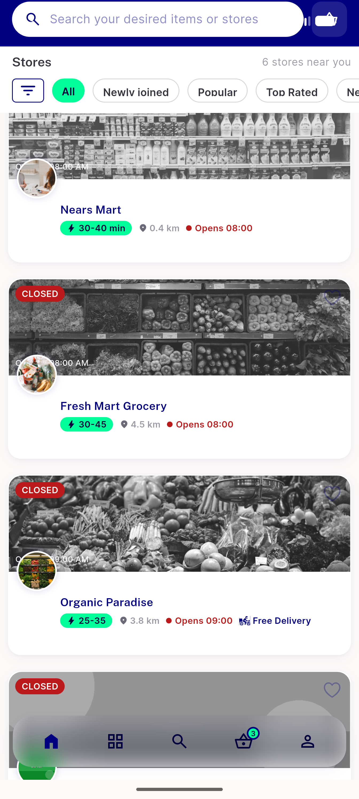
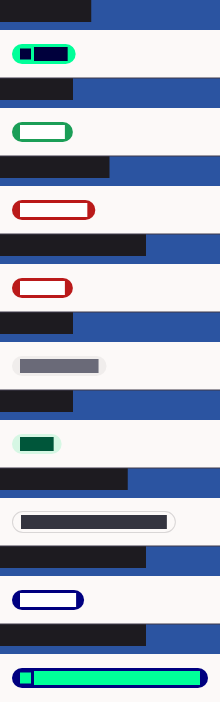
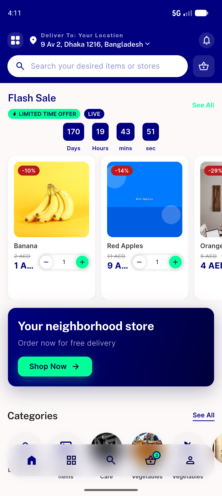
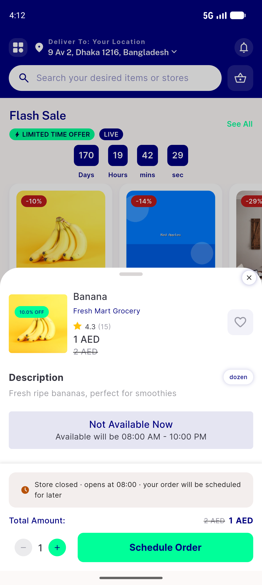
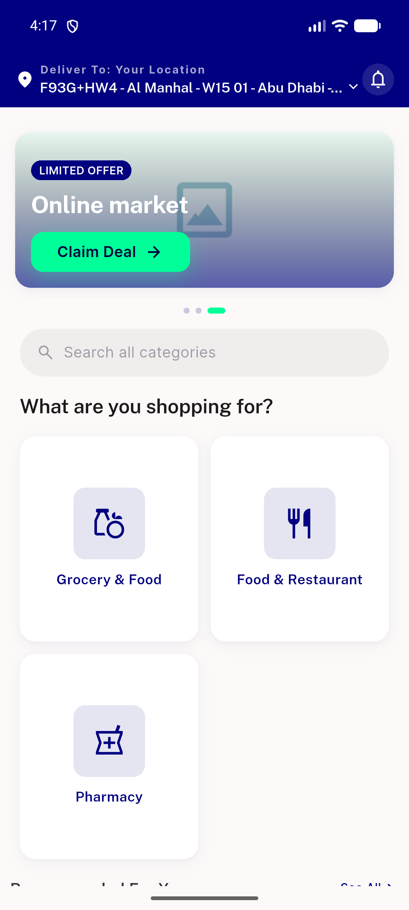
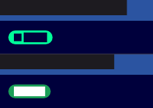
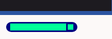

# QA Evidence — NEARS-1350

**PASS — NBadge consolidation: badge tokens render pixel-parity across UserApp (light); delivery navy+mint verified via golden+AC8 unit matrix**

**8 screenshot(s).** Click any thumbnail for full resolution.

<table>
<tr>
<td align="center" width="33%"> ac1 home storecards light</td>
<td align="center" width="33%"> ac1 storelist row closed light</td>
<td align="center" width="33%"> ac2 ac8 nbadge mappings golden</td>
</tr>
<tr>
<td align="center" width="33%"> ac3 ac4 module flashsale priceoff light</td>
<td align="center" width="33%"> ac3 item quickview light</td>
<td align="center" width="33%"> ac4 home abudhabi limitedoffer light</td>
</tr>
<tr>
<td align="center" width="33%"> ac6 nbadge dark golden</td>
<td align="center" width="33%"> ac6 nbadge rtl golden</td>
</tr>
</table>

### Other artifacts
- [`progress.md`](progress.md)

---
*From `nears/docs/qa-evidence/NEARS-1350/` · public-repo scrub policy (no live secrets; verified clean).*
